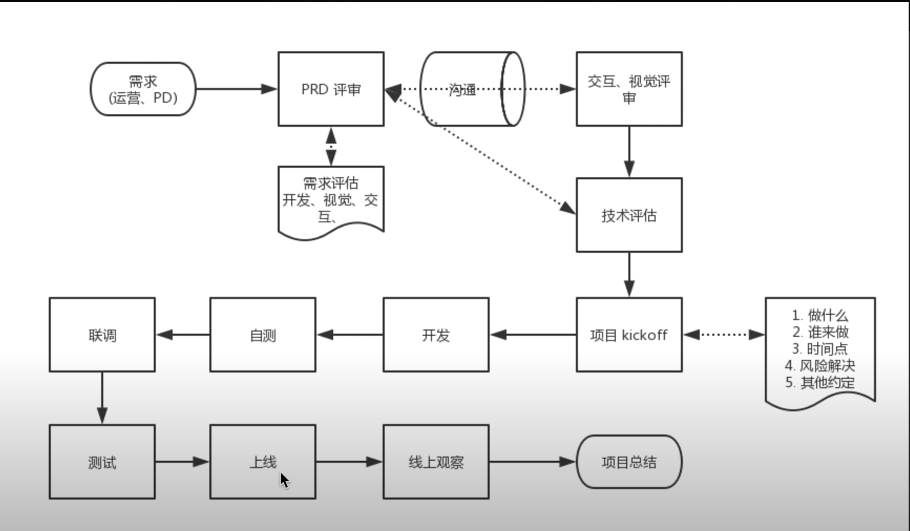

# 一些基础概念

## 网站开发流程

## 

## 开发所需的三大能力

搜索  分析  调试

## 一些概念

### w3c 

万维网联盟（World Wide Web Consortium，缩写 W3C），又称 W3C 理事会，是万维网的主要国际标准组织

### Ecma 

 一家国际性会员制度的信息和电信标准组织。94年 之前名为欧洲计算机制造商协会（European Computer Manufacturers Association）

### EcmaScript 和 JavaScript  

- EcmaScript：一种由 Ecma 国际通过 ECMA-262 标准化的脚本程序设计语言
- JavaScript：通用的跨平台脚本语言，遵守 ECMA262 的标准，换句话说就是 ECMAscript 的方言，其他的还有微软的 jscript 等。是 EcmaScript 的扩展，包括 EcmaScript，Bom，Dom

### shell

一种应用程序，它连接了用户和 Linux 内核，让用户能够更加高效、安全、低成本地使用 Linux 内核，这就是 Shell 的本质

### bash  

shell 的一种实现

### URL

统一资源定位符，用于定位互联网上的资源。有 http、https、ftp、file 等协议

- http 用于定位互联网上的资源
- https 加密的 http
- file 用于定位本地资源

如果一个 URL 以 `//` 开头，说明这个 URL 的协议和当前页面保持一致

### IP

每个处于互联网中的设备都有 IP 地址，形如 192.168.0.1

局域网 IP 和 本地 IP 是有差别的

127.0.0.1 代表本机的 IP

