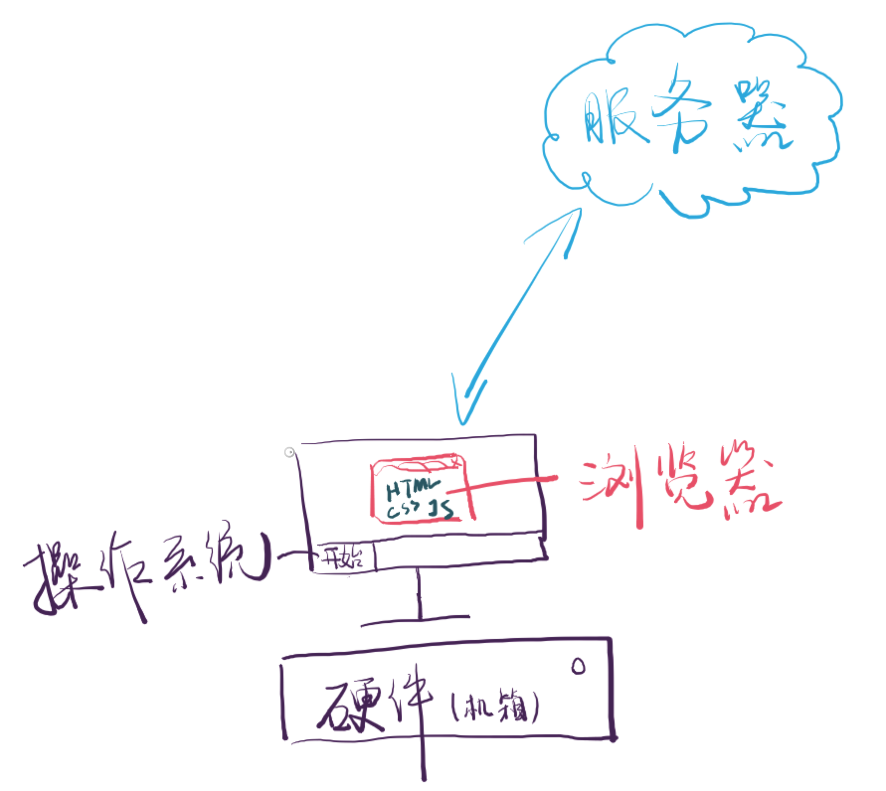
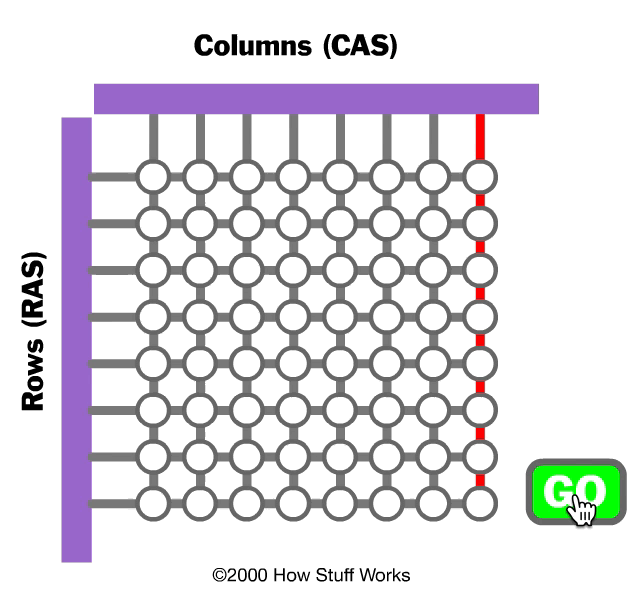
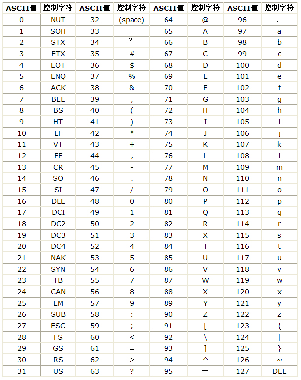
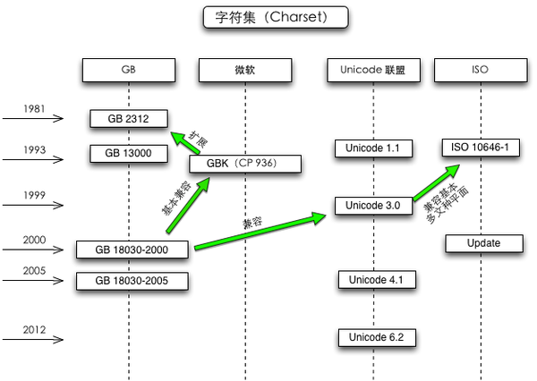

# 编程基础之计算机是如何存储数据的
##  编程基础

### 程序员应该学的编程基础

前端程序员首先是程序员，其次才是前端，所以了解一些编程基础是很有必要的。所有程序员都需要知道以下计算机基础知识：

1. 硬件与软件：计算机的运行原理（《[编码](https://book.douban.com/subject/4822685/)》）
2. 最大的软件：操作系统（[维基百科](https://zh.wikipedia.org/wiki/操作系统)）
3. 自己写软件：数据结构 & 算法（《[数据结构与算法分析](https://book.douban.com/subject/1139426/)》）
   - 最低要把所有的排序算法搞明白
4. 多人写软件：软件工程（[代码大全](https://book.douban.com/subject/1477390/)）

### 前端程序员应该学的编程基础
- 运行环境依赖
  - `操作系统`运行于`硬件`之上
  - `浏览器`运行于`操作系统`之上
  - HTML/CSS/JS 运行于`浏览器`之上
- 数据依赖

  - HTML/CSS/JS 和`数据`都来自于`服务器`

  

计算机技术知识的特征是层次性很强。上图表示，前端经常打交道的 HTML/CSS/JS 的运行环境是成立在很多基础知识之上的，如果不深入学习是无法理解 HTML/CSS/JS 是怎么运行的；再者，前端需要的数据是服务器来的，所以我们要关注服务器知识以及网络协议（HTTP）。一定要避免把自己困在上图的红色框里，防止成为困死在浏览器里的井底之蛙。

## 计算机：二进制的世界

`1110 0100 1011 1101 1010 0000 1110 0101 1010 0101 1011 1101`

计算机中只能存储 0 和 1，上面一行数字就是「你好」在计算机里的表示方式。为什么「你好」这两个字会这么存储呢？经历了什么过程？下面就开始我们的探索之旅吧。

### 第一步：如何存储 0 和 1？

#### 存储

上图演示的是计算机存储 0 和 1 的过程。圆点就是存储 0 和 1 的机关。为了方便，可以理解为 1 个电池，红色表示充满了电，白色表示电量为 0。计算机在存储 0 和 1 的时候，一次性存 8 位。首先选中纵向的一列（即 8 个圆点），随后横向的8条管道向选中的列输送电量，如果某一个机关存储的是 0 就不充电，是 1 就充满电。这是理想情况下的存储。

但是有一个问题，我们是在给晶体管充电，从 0 到充满是纳秒（1 0^-9^ 秒）级别，充满电后大概几毫秒（10^-3^ 秒）电量就消耗完了，机关中存储的数据自然也就没了，即所有的 0 和 1 都不见了。但是我们需要的是将数据长久的存储在计算机中。  

为了解决耗电快这个问题，计算机需要不断刷新。不断给需要存储1的机关充电，在它的电量耗完之前再次充电，保证其存储的数据不变。CPU 常见的表示频率的单位 `HZ` 就表示每秒能充多少次电。

#### 读取

- 电量大于 50% 就是 1
- 电量小于 50% 就是 0

### 第二步：如何存储数字

0 和 1 可以存了，就可以将十进制数转换为二进制数在计算机中存储了。比如：

> 37~10~ == 100101~2~
>
> -37~10~ == -100101~2~
>
> 0.75~10~ == 0.11~2~

回到最初的那句话，计算机只能存 0 和 1，所以负号不能存，因此负数会以[补码](https://zh.wikipedia.org/wiki/二補數)的形式存储。小数点不能存，小数会以[浮点数](https://zh.wikipedia.org/wiki/浮点数)的形式存储 。受限于篇幅，补码和浮点数的具体规则这里就不详细介绍。

### 第三步：如何存储字符

存储数字的问题解决了，存储字符的思路是将每个字符编号。计算机中存储的实际是某个字符的编号。最先出现的编码方案是 ASCII（美国信息交换标准代码），毕竟计算机最先出现在美国。美国人将英语需要的字符全部编了号，从 0 ~ 128，一共128个字符。比如你想储存 a，那么就储存 9710 对应的二进制，即 a -> 0110 00012 -> 6116。如果你想储存 1，那么就储存 4910 对应的二进制，即 1 -> 0011 00012 -> 3116。更多字符的编号见下表。

### 第四步：如何存储中文

ASCII编码只将英语语言环境下需要的字符进行编码。当计算机在非英语国家使用时这个编码规则自然行不通了。中文常用汉字都 6000 以上。中国就推出了一个自己的编码规则，即 [GB 2312 中国国家标准简体中文字符集](https://zh.wikipedia.org/wiki/GB_2312)。GB2312 是对 ASCII 的中文扩展。

GB2312 共收录 **6763 个汉字**，同时收录了包括拉丁字母、希腊字母、日文平假名及片假名字母、俄语西里尔字母在内的 **682 个字符**。具体规则是一个小于127的字符的意义与原来相同，但两个大于 127 的字符连在一起时，就表示一个汉字。前面的一个字节（他称之为高字节）从 0xA1 用到 0xF7，后面一个字节（低字节）从 0xA1 到 0xFE，这样我们就可以组合出大约 7000多个简体汉字了。在这些编码里，我们还把数学符号、罗马希腊的字母、日文的假名们都编进去了，连在 ASCII 里本来就有的数字、标点、字母都统统重新编了两个字节长的编码，这就是常说的”全角”字符，而原来在 127 号以下的那些就叫”半角”字符了。

后来为了存储生僻字、繁体字、日语、朝鲜语等，又推出了 [GBK 字符集](http://www.knowsky.com/resource/gb2312tbl.htm)。具体规则是：不再要求低字节一定是 127 号之后的内码，只要第一个字节是大于 127 就固定表示这是一个汉字的开始。GBK包括了 GB2312 的所有内容，同时又增加了近 20000 个新的汉字（包括繁体字）和符号。 后来少数民族也要用电脑了，于是再扩展，又加了几千个新的少数民族的字，GBK 扩成了 **GB18030**。通称他们叫做 “**DBCS**“（Double Byte Charecter Set 双字节字符集）。在 DBCS 系列标准里，最大的特点是两字节长的汉字字符和一字节长的英文字符并存于同一套编码方案里，因此他们写的程序为了支持中文处理，必须要注意字串里的每一个字节的值，如果这个值是大于 127 的，那么就认为一个双字节字符集里的字符出现了。这就早年“一个汉字算两个英文字符”这句话的由来。

### 第五步：如何存储所有字符

其实，不但中国搞了一套自己的编码规则，各个国家都像中国这样搞出一套自己的编码标准，结果互相之间谁也不懂谁的编码，谁也不支持别人的编码，连台湾和大陆都使用不同的编码方案（BIG5 ）。这给使用计算机带来了很大的障碍。

一个叫 **ISO**（国际标谁化组织）的国际组织决定着手解决这个问题。他们采用的方法很简单：废了所有的地区性编码方案，重新搞一个包括了地球上所有文化、所有字母和符号的编码。他们打算叫它”Universal Multiple-Octet Coded Character Set”，简称 **UCS**, 俗称 “**Unicode**“。包括中日韩文字、藏文、盲文、楔形文字、 [颜文字](https://zh.wikipedia.org/wiki/表情符號列表#ref_U1F600_as_of_Unicode_version)`:-)`、 绘文字😂

最初，Unicode使用两个字节表示一个字符。这一标准的 2 字节形式通常称作 UCS-2。然而，受制于 2 字节数量的限制，UCS-2 只能表示最多 65536 个字符。Unicode 的 4 字节形式被称为 UCS-4 或 UTF-32，能够定义 Unicode 的全部扩展，最多可定义 100 万个以上唯一字符。

Unicode 是一种字符集，Unicode 的学名是 "Universal Multiple-Octet Coded Character Set"，简称为UCS。UCS 可以看作是 "Unicode Character Set" 的缩写。

> UCS-4 是一个更大的尚未填充完全的 31 位字符集，加上恒为 0 的首位，共需占据 32 位，即 4 字节。理论上最多能表示 2^31^ 个字符，完全可以涵盖一切语言所用的符号。

截止到2019 年 5 月时，Unicode 总共收录了 137,994 个字符

### 第六步：如何将 Unicode 存到计算机里

Unicode 同样也不完美，有三个的问题：

1. 如何才能区别 Unicode 和 ASCII？计算机怎么知道三个字节表示一个符号，而不是分别表示三个符号呢？
2. 英文字母只用一个字节表示就够了，如果 Unicode 统一规定，每个符号用两个字节表示，这对于存储空间来说是极大的浪费，文本文件的大小会因此大出一倍，这是难以接受的。
3. UTF-32 和 UTF-16 和 C 语言不兼容。因为 C 语言中 **0000 0000 ** 表示字符串结尾，而 UTF-32 和 UTF-16 中有很多字符高位都是 0，和字符串结尾冲突了。

此时，UNIX 之父 Ken Thompson 提出的 UTF-8 编码完美解决了上述问题。这是一个高性价比、准确无歧义的编码方式。

------

**低性价比**

a -> 00000000 00000000 00000000 011000012 = 006116

你 -> 00000000 00000000 01001111 011000002 = 4F6016

**高性价比 UTF-8**

a -> 01100001

你-> **111**00100 **1**0111101 **1**0100000

UTF-8 是一种编码方式，不是字符集。可以理解为 Unicode 为所有的字符编了一个号码，即唯一 ID。UTF-8 是将这个 ID 存储到计算机中的一种解决方案。具体的规则如下：

想要转换UTF-8，必须要先明白UTF-8是如何表示Unicode码的。UTF-8的编码规则如下：

1. 如果Unicode码小于等于127，即ASCII码。则仍使用ASCII的编码格式，最高位为0，其余7位表示0-127。

2. 如果，Unicode码大于127，以大端表示。然后从低位开始，每次取6位，加上高位的10，组成一个字节，直到不足6位。假设前面一共组成了n个字节，那么把前n+1位都标记为1，其余位标记为0。然后加上不足的6位，组成UTF-8编码的头部字节。最后把这些字节从低位到高位，拼成一串编码。   

下面对两种情况进行了举例说明：

#### 1. ASCII 码的编码格式

如果是ASCII，则不改变编码方式，直接用 ASCII 的编码，这样主要是为了向后兼容。例如 ASCII 码中的大写字母 “S”，是第  83 个字符，编码为 **0101 0011**， 0x53，一个字节表示。在 UTF-8 中保持不变，还是 **0101 0011**， u'\u53'，还是一个字节。

#### 2. 非 ASCII 码的编码格式

我们按照上面的规则一步步来编码，把“习”字转换成 UTF-8 编码。

- 如果，Unicode 码大于 127，以大端表示。

  - “习”的 UTF-16 编码为“\u4E60”，以大端表示为‭ **‭0100 1110 0110 0000‬。**
- 从低位开始，每次取 6 位，加上高位的 10，组成一个字节，直到不足6位。

  - 取 6 位 **10 0000**，再加上高位的 10，组成一个字节 **1010 0000**。
  - 再取 6 位 **1110 01**，再加上高位的 10，组成一个字节 **1011 1001**。
- **0100**，不足6位，前面一共组成了2个字节，n=2。把前 n+1 都标记为 1，其余位标记为 0，即 **1110 0000**。然后加上不足的 6 位，组成 UTF-8 编码的头部字节，即 **1110 0000 + 0100 = 1110 0100**。
- 最后把这些字节从低位到高位，拼成一串编码，**1110 0100 1011 1001 1010 0000**。即 E4B9A0，通常表示为 “\xE4\xB9\xA0”。

下表是不同范围的 Unicode 码对应的 UTF-8 编码的字节数：

| 编号范围            | 字节 |
| :------------------ | :--: |
| 0x0000 - 0x007F     |  1   |
| 0x0080 - 0x07FF     |  2   |
| 0x0800 - 0xFFFF     |  3   |
| 0x010000 - 0x10FFFF |  4   |

[更多](https://zh.wikipedia.org/wiki/UTF-8#UTF-8.E7.9A.84.E7.B7.A8.E7.A2.BC.E6.96.B9.E5.BC.8F)

### 历史问题

为什么有些中文软件喜欢用 GBK，不用 Unicode？这通常会造成乱码问题。这主要还是历史原因，请看下面各种编码出现的时间图。现代程序员一定要使用 UTF-8 。

再一个就是关于 JS。**JavaScript 使用了 Unicode 字符集，但是没有使用 UTF-8 编码**

> JavaScript 用了 UCS-2 编码！ 只能表示两个字节，之后的就不能表示了。
> 因为 1995 年 UTF-16 还没被发明出来， JavaScript 也不想使用 UTF-32

[具体看这里](http://www.ruanyifeng.com/blog/2014/12/unicode.html)

**后果**

> ES5 无法表示 `\uFFFF` 之后的字符（如 `\u1D306`），某些情况下会出 bug

[更多](http://www.alloyteam.com/2016/12/javascript-has-a-unicode-sinkhole/)

### 补充

上面两篇文章有些地方自我矛盾。比如下面这段

> 是以字符 `𝌆` 为例，它的 UTF-16 编码是 4 个字节的 `0xD834 DF06 `。问题就来了，4 个字节的编码不属于 UCS-2，JavaScript 不认识，只会把它看作单独的两个字符 `U+D834` 和 `U+DF06`。

"`𝌆`" 字符的 Unicode 编码是 `\u{1d306}`，`"𝌆".charCodeAt(0)`的返回值是 `U+D834`。那么问题来了，既然 JS 是不支持 UTF-16 的，那么怎么会返回字符的 UTF-16 编码的前两个字节呢？这个字符的 UTF-16 编码 JS 是怎么获得的呢？要返回前两个字节首先要获得完整的 UTF-16 编码吧。如果 JS 只支持 UCS-2，那么这个逻辑是说不通的。

> **charCodeAt()** 方法返回 0 到 65535 之间的整数，表示给定索引处的 UTF-16 代码单元 (在 Unicode 编码单元表示一个单一的 UTF-16 编码单元的情况下，UTF-16 编码单元匹配 Unicode 编码单元。但在——例如 Unicode 编码单元 > 0x10000 的这种——不能被一个 UTF-16 编码单元单独表示的情况下，只能匹配 Unicode 代理对的第一个编码单元) 。如果你想要整个代码点的值，使用 **codePointAt**()。

上面是 MDN 的原文。意思是基本平面的字符（即码点小于 65535）直接返回 UTF-16 的两个字节的编码，即 UCS-2，因为基本平面的字符的 UTF-16 编码和 UCS-2 是一样的。辅助平面的字符（即码点大于 65535，UTF-16编码为 4 字节）返回该字符 UTF-16 四字节编码的前两个字节。这就与 JS支持的是 UCS-2 矛盾。既然 JS 支持的是 UCS-2 不支持 UTF-16 ，那么 `charCodeAt()` 为什么偏偏返回的是字符的 UTF-16 的前两个字节，为什么不返回 UTF-8 的前两个字节？或者 UTF-32?个人理解是 `charCodeAt()` 函数支持 UTF-16，但是支持的不完全。基本平面度的字符 UTF-16 的编码和 UCS-2 相同，此时不会有什么问题；辅助平面的字符采用 UTF-16 编码是四字节，因为 ES5 之前的 JS 的字符都是两个字节，所以只能返回前两个字节，此处设计上有一个 BUG。

上面只是从逻辑上分析，没有什么根据。因为这方面的资料没找到。不过随着 ES6 已经成为主流，直接用 `codePointAt()` 即可。即使用 ES5 的函数，只需要记住 MDN 的描述就行。没必要纠结这个老问题了。

参考链接：

[Unicode 和 UTF-8 有什么区别](https://www.zhihu.com/question/23374078/answer/69732605)

[Unicode和UTF-8互相转换](https://zhuanlan.zhihu.com/p/45695434)

[Unicode字符占几个字节](https://segmentfault.com/q/1010000009652523)