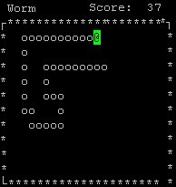

# Linux 命令行

## 为什么要学命令行

实际上是先有命令行，后有的图形界面。
最开始的游戏也是在命令行上的（想不到吧？），那时的游戏长这样：





世界上第一个程序员（女）也是通过命令行来编程的，所以一个程序员不学命令行是说不过去的。

对于前端来说，现代的前端工具都没有提供图形界面，只有命令行界面，所以从实用角度出发，必须学命令行。包括 Gulp、Webpack、SASS、Node.js、Vue、React、Angular。不学命令行还怎么混？

## 哪些系统提供了命令行

  1. Windows 的命令提示符和 Git Bash 是命令行
  2. Linux（如 Ubuntu) 的终端也是命令行
  3. Unix（如 macOS）的终端也是命令行

## Gitbash

Gitbash 不是 Git，是 Git 提供的一个 bash。也可以用 Cmder 代替。

Windows 和其他操作系统平台的回车符是有区别的。

|          平台           | 符号 |
| :---------------------: | :--: |
| Linux / Unix / 新 Macos |  \n  |
|         Windows         | \r\n |
|        旧 Macos         |  \r  |

目前现存的主要是上面两个流派，即 `\n` 流或者 `\r\n` 流。

Gitbash 不支持 `sudo` 命令，用管理员权限打开 Gitbash 就相当于 `sudo`。

## 基本概念
- Linux 上没有盘符，整个硬盘就是` /`，叫做 根目录
- 文件、目录、路径、节点
   - 文件
    - 目录，就是文件夹
        - 当前目录，用 `. `表示
        - 父目录，用 `..` 表示
- 节点 = 文件 或者 目录
- 路径
  - 绝对路径，以 `/` 开头，能唯一确定一个节点
    - 如 `/tmp/a/1.txt`
  - 相对路径，不以 `/` 开头，是一个相对值
    - 如 `/a/`, `./a/`
    - 如 `b.txt`, `./b.txt`
    - 如 `a/b.txt`, `./a/b.txt`
    - 如 `../c/d.txt`
## 命令行的样子
> $ 命令 -选项缩写 *--选项* *参数*
> 结果
## 基本单词

命令行其实是很多单词的缩写，下面列出几个比较常见的单词。

|   英文    |      翻译      |
| :-------: | :------------: |
| directory |  目录、文件夹  |
|   file    |      文件      |
|   make    |      新建      |
|  remove   |      删除      |
|   move    |      移动      |
|   copy    |      复制      |
|   list    |      罗列      |
|   link    |      链接      |
|   find    |      查找      |
|   echo    | 发出回音、重复 |
|   touch   |      触摸      |
|  change   |      改变      |

## 缩写
**1. 程序员为了「输入方便」对命令进行缩写**
**2. 缩写规则是省略 A、E、I、O、U 五个元音字母，留下 2 到 3 个字母（有时会例外)**

|     命令      |      全写      | 缩写  |
| :-----------: | :------------: | :---: |
|   创建目录    | make directory | mkdir |
|     删除      |     remove     |  rm   |
| 移动 / 重命名 |      move      |  mv   |
|     复制      |      copy      |  cp   |
|     罗列      |      list      |  ls   |
|     链接      |      link      |  ln   |
* Windows 系统默认不支持链接
**3. `~` 表示用户目录**
- 假设你的用户名是 administrator，那么
  - 在 Windows 系统，~ 表示 /Users/administrator/ 目录（一般在 C 盘）
  - 在 Linux 系统，~ 表示 /home/administrator/ 目录
## 常见命令
| 操作                       | 命令                                                         |
| -------------------------- | ------------------------------------------------------------ |
| 进入目录                   | cd                                                           |
| 显示当前目录               | pwd                                                          |
| 创建目录                   | mkdir 目录名                                                 |
| 创建目录                   | mkdir -p 目录路径                                            |
| 我是谁                     | whoami                                                       |
| --                         | --                                                           |
| 查看路径                   | ls 路径                                                      |
| 查看路径                   | ls -a 路径                                                   |
| 查看路径                   | ls -l 路径                                                   |
| 查看路径                   | ls -al 路径                                                  |
| --                         | --                                                           |
| 创建文件                   | echo '1' > 文件路径                                          |
| 强制创建文件               | echo '1' >! 文件路径                                         |
| 创建文件(在文件后追加内容) | echo '1' >> 文件路径                                         |
| 创建文件                   | touch 文件名                                                 |
| 改变文件更新时间           | touch 文件名                                                 |
| --                         | --                                                           |
| 复制文件                   | cp 源路径 目标路径                                           |
| 复制目录                   | cp -r 源路径 目标路径                                        |
| --                         | --                                                           |
| 移动节点                   | mv 源路径 目标路径                                           |
| --                         | --                                                           |
| 删除文件                   | rm 文件路径                                                  |
| 强制删除文件               | rm -f 文件路径                                               |
| 删除目录                   | rm -r 目录路径                                               |
| 强制删除目录               | rm -rf 目录路径                                              |
| --                         | --                                                           |
| 查找文件                   | find . [-type (d f)]（可选） -name 'xxx'                     |
| --                         | --                                                           |
| 查看目录结构               | tree                                                         |
| 建立软链接                 | ln -s 真实文件 链接                                          |
| --                         | --                                                           |
| 下载文件                   | curl -L [https://www.baidu.com](https://www.baidu.com/) > baidu.html |
| 拷贝网页                   | wget -p -H -e robots=off [https://www.baidu.com](https://www.baidu.com/) (Windows 不支持 wget) |
| 磁盘占用                   | df -kh                                                       |
| 当前目录大小               | du -sh .                                                     |
| 各文件大小                 | du -h                                                        |
* 永远不要运行 `rm -rf /`
> 如何学习我目前还没有掌握的命令？

Google: Linux 查看文件内容

## 快捷操作技巧
| 操作                     | 命令                          |
| ------------------------ | ----------------------------- |
| 回到刚才的目录（返回）   | cd -                          |
| 使用上一次的命令         | 上                            |
| 使用上一次的命令         | !!                            |
| 使用上一次的最后一个参数 | <kbd>alt</kbd> + <kbd>.</kbd> |
| 一句话执行两个命令       | xxx; yyy                      |
| 一句话执行两个命令       | xxx&& yyy                     |
## 如何在命令里面打回车？
- `\` 后面接回车
## 什么时候加引号？
- 有空格等特殊字符的时候加引号
## 如何自学命令行
- man ls
- ls -h
- ls --help
- ExplainShell.com
## 使用 vim 编辑文件
- 如何退出 vim
  - 按一下 ESC
  - 依次按下 :wq，回车
- 如何输入
  - i 命令
## 如何学习 vim
vim 被誉为 [编辑器之神](https://upclinux.github.io/intro/07/vim-and-emacs/)。

入门 vim，下面是三个教程：

1. 在命令行输入 vimtutor ，即可查看官方自带的中文教程。看完它。
2. [简明 VIM 练级攻略](http://coolshell.cn/articles/5426.html)
3. [一个 vim 游戏](https://vim-adventures.com/)

## 关于 z

z 是一个很好的工具，可以保存命令行去过的所有目录，只需要在命令行里打出想要到达的目录的一部分，就可以进行模糊匹配。使用方法如下：

1. github 上下载 z.sh
2. 在 .bashrc 添加 `. z.sh的路径` 或 `source . z.sh的路径`

然后就可以使用了。

## 关于 ls -a

`ls -a`

加了 `-a` 以后，会显示隐藏的文件，按照 Linux 的传统，隐藏文件是以 `.` 开头的，即加 `-a` 命令行会显示以 `.` 开头的文件，反之不会。Linux 图形界面也不显示以 `.` 开头的文件

这个规则在 Windows 上无效，win 上隐藏文件不是通过以 `.` 开头实现。win 的图形界面能显示以 `.` 开头的非隐藏文件。命令行里不加 `-a`，以 `.` 开头的文件，不管是不是隐藏文件都显示不了，实际的隐藏文件，不是以 `.` 开头也显示不了

## 技巧

如果你不会一些命令行技巧，你就体会不到命令行的高效之处

### ~/.bashrc

~/.bashrc 文件是 bash 的一些配置文件。比如可以设置一些  alias，方便进一步简化命令行的输入，功能很强大

#### 自动运行

1. 首先 `touch ~/.bashrc` 创建一下这个文件
2. `start ~/.bashrc` 选用编辑器编辑这个文件，内容为 `echo 'Hi'`
3. 你也可以用命令行编辑文件 `echo "echo 'hi'" >> ~/.bashrc`
4. 关闭退出 Git Bash，然后打开 Git Bash，就看到了 Hi，这说明每次进入 Git Bash，就会优先运行 ~/.bashrc 里面的命令
5. 重新编辑 ~/.bashrc，内容改为 `cd ~/Desktop`，重启 Git Bash，有没有发现默认就进入桌面目录了？

可以用 ~/.bashrc 在进入 Git Bash 前执行任何命令，十分方便。

#### alias

1. 在 ~/.bashrc 里**新增**一行 `alias f="echo 'frank is awesome'"`，等于号两边不能有空格，你最好一个字都不要错。

2. 运行 `source ~/.bashrc`，作用是执行 ~/.bashrc

3. 运行 `f`，就会看到 `frank is awesome`

4. 也就是说，现在 f 就是 echo 'frank is awesome' 的缩写了，利用这个技巧，我们可以把很多常见的命令缩写一下，比如

   ```
    alias la='ls -a'
    alias ll='ls -l'
    alias gst='git status -sb'
    alias ga='git add'
    alias ga.='git add .'
    alias gc='git commit'
    alias gc.='git commit .'
   ```

   保存退出，然后运行

   ```
   source ~/.bashrc
   ```

5. 这样一来，你的 Git 操作就会简单很多：

   ```
    ga 1.txt
    ga .
    gc 1.txt
    gc.
    gst
   ```

接下来说两个目前用不到的技巧。

### 环境变量

还可以在 ~/.bashrc 里面设置一些环境变量，比如你可以在 ~/.bashrc 里面添加一行

```
export SASS_BINARY_SITE="https://npm.taobao.org/mirrors/node-sass"
```

那么以后你安装 node-sass 的时候就不会因为被墙而报错了。以后会用到的，现在先说一下。

### 设置 PATH

在 .bashrc 里面写下

```
export PATH="目录的绝对路径:$PATH"
```

可以在 PATH 里添加一个目录。

## 辅助资源

- [命令行释义](https://explainshell.com/explain?cmd=ls+-lrt)

- [命令行常见用法](https://github.com/tldr-pages/tldr#tldr)