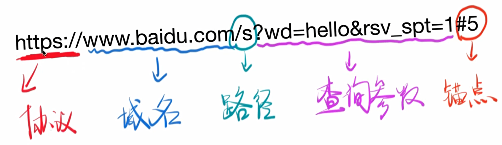
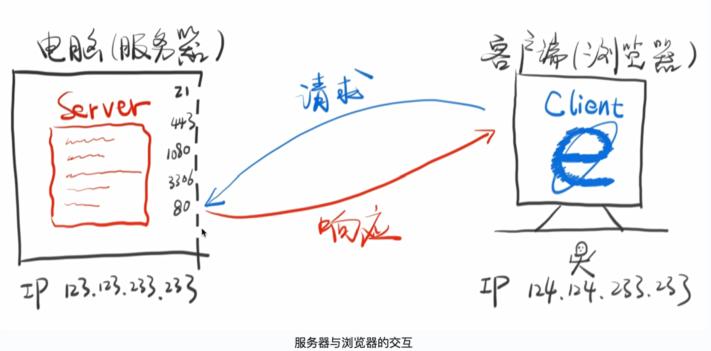

# HTTP 入门

## WWW（万维网）的来历

### 1990 年

1990 年前后，万维网（World Wide Web）诞生。这一年 Tim Berners-Lee 发明了用网址就能访问网页的办法，他发明了第一个网页、第一个浏览器和第一个服务器。

### 1990 年之前

人类在 1950 年 ~ 1960 年就已经发明了互联网（互联网是万维网的基石，这时候还没有网页）的雏形，不过那时只有科研机构、军方和政府能进入这个网络。

后来逐步扩大到所有人都能进入这个网络。

不过 1990 年之前，没有网页。

那么人们在电脑面前做什么呢？游戏和办公软件软件不需要联网，当时也没有浏览器，所以大家是怎么上网的？

当时人们对互联网的使用主要集中在 Email。

- 1965 年，Email 被发明出来，成为互联网的「杀手级」应用，因为你可以瞬间发一封信给远方的人，不需要信纸、邮票和邮递员。

- 1971 年，用 @ 符号来表示 Email 的方法被发明出来。

- 1979 年，邮件讨论组被发明出来，人们可以在一个话题下公开地互发邮件。

- 人们通过 FTP 来下载文件附件

- 1980 年至 1990 年间，人们迫切需要一种更好的上网方式，很多方案被提出，如 HTTP 和 Gopher。后来，HTTP 因为其易用性胜出。

- 当时的邮件内容全都是普通文本，或者是类 Markdown[^1]形式的文本，人们需要一种超级文本用来做页面跳转，也就是我们现在见到的 `<a>` 标签，不过那时的人还没想到这一点，当时的超级文本方案有很多，HTML 只是其中之一，而且当时的 HTML 也非常简陋，只有 11 个标签。

### WWW 的发明

在这种背景之下， Tim Berners-Lee（下文中称为李爵士） 在 1989 年至 1992 年间，发明了 WWW（World Wide Web），一种适用于全世界的网络。

主要包含三个概念：

1. URI：统一资源标识符，俗称网址

2. HTTP：两个电脑之间传输数据的协议——超文本传输协议

3. HTML：超级文本，当时主要用来做页面跳转——超文本标记语言

URI 的作用是能让你访问一个页面，HTTP 的作用是告诉服务器怎么传输页面，让你能下载这个页面，HTML 的作用是让你能看懂页面。这是一个简单而完美的系统，这三样东西每个都解决了一个小问题，合起来就形成了一个能够让全世界的人都能访问的 WWW（万维网）。

李爵士除了发明了这些概念，还付诸了行动：

1. 发明了第一个服务器

2. 发明了第一个浏览器

3. 写出了第一个[网页]( http://info.cern.ch)

2009 年李爵士在 TED 上有一个 [演讲](https://www.ted.com/talks/tim_berners_lee_on_the_next_web)，说出了他为什么发明 WWW。

2017 年，李爵士获得了图灵奖。


### URI 是什么

URI（统一资源标识符） 用于标识某一互联网资源的字符串

URI 分为 URL（统一资源定位符） 和 URN（统一资源名），我们一般使用 URL 作为网址。

URI = URL + URN。URL 和 URN 都是 URI 的子集。

### URN

URN 用来唯一确定一个名称

ISBN: 9787115275790 （书号）就是一个 URN，通过 URN 你可以确定一个**唯一的**资源，ISBN: 9787115275790 对应的资源的是《JavaScript 高级程序设计（第三版）》这本书。去任何一个图书馆、书店，他们都知道是这本书。再比如一个人名，如果有重名的那就不是 URN，因为通过这个名字不能唯一确定一个人，反之则是。

上面的书号和人名就是 URN 的例子，通过 URN 能在任何系统里面确定这个 URN 所对应的资源**是什么**

### URL

URL 用来唯一确定一个位置

https://www.baidu.com/s?wd=hello&rsv_spt=1#5（网址） 就是一个 URL，通过 URL 你可以确定一个**唯一的**地址（网址）。与 URN 不同的是，URL 并不能确定它所指示的位置具体有什么东西。

URL的常见组成：



域名：域名分为一级域名，二级域名，三级域名。www.baidu.com 和 baidu.com 不是同一个域名，它们共有相同的一级域名和二级域名，com 是一级域名，baidu 是二级域名。

路径：路径是一个表示地址的字符串，不是任何文件或文件夹，路径和文件或者文件夹**不是**同一个东西。

锚点：用来定位当前页面上的一个位置。

注意：URL 一般还包括「端口」，图中没有写

### DNS

域名系统

- 输入域名

- 输出 IP

```shell
nslookup baidu.com    // 查询 baidu.com 的 ip
ping baidu.com
```

## 请求

### Server & Client & HTTP



端口：如上图左边所示，每个服务器都有很多端口，每个端口都只做一件事情。这跟 TCP/IP 协议有关，现在先简单的理解为：从 0 到 2048 的这些端口都是指定好的要做某些事情。比如 21 端口是用来做 ftp 服务的。即如果要做一个 ftp 服务器，那么就要把 21 端口开放出来。443：https 端口。 1080： 代理服务器端口。80：服务 http 协议。所以如果要做一个后台服务器，那么必须把 80 端口暴露出来给别人连。

服务器与浏览器的交互过程：

1. 浏览器负责发起请求

2. 服务器在 80 端口接收请求

3. 服务器负责返回内容（响应）

4. 浏览器负责下载响应内容

HTTP 的作用就是指导浏览器和服务器如何进行沟通。比如：当浏览器发送一个正确的请求，服务器就响应相应的内容；在浏览器地址栏输入 URL 的时候输入错误，这时候浏览器就会响应一个 404；或者说当一个请求过来的时候，服务器没有开机，那么这时候服务器就应该响应一个 502。

### 请求实例

#### 实例1：Get 请求

```shell
curl -s -v -H "qingqiu: xxx" -- "https://www.baidu.com"
```
用 curl 创造一个请求并发送，然后到响应。请求的内容为：

```
1. GET / HTTP/1.1              // 获取根目录，协议为 HTTP 1.1
2. Host: www.baidu.com		   // 访问的域名
3. User-Agent: curl/7.54.0     // 用 curl/7.54.0 这个软件发起的响应
4. Accept: */*				   // 接受返回的任何内容
5. qingqiu: xxx				   // -H "qingqiu: xxx"中的内容，可以加可以不加，没有什么意义。
6. 							   // 回车（\n）
```
上面就是通过 curl 给百度服务器发送的 6 行话，这就是一个请求。注意最后一行为空白内容，上面的序号是为了表示有几行，实际的请求内容中没有序号。

#### 实例2：Post 请求

```shell
curl -X POST -s -v -H "qingqiu: xxx" -- "https://www.baidu.com"
```
请求的内容为：
```
1. POST / HTTP/1.1                    // Get 变为 Post。
2. Host: www.baidu.com
3. User-Agent: curl/7.54.0
4. Accept: */*
5. qingqiu: xxx
6. 
```
这个请求跟上面的比，唯一的变化就是 GET 变为了 POST，得到的相应内容完全不一样了。具体区别可以复制到命令行去看。

#### 实例3：带参数的 Post 请求

```shell
curl -X POST -d "1234567890" -s -v -H "qingqiu: xxx" -- "https://www.baidu.com"
```
上面这个请求会向百度服务器上传一段数据，`- d` 是 data 的意思，后面接的 `1234567890` 表示要向服务器上传的数据。

请求的内容为：

```
1. POST / HTTP/1.1
2. Host: www.baidu.com
3. User-Agent: curl/7.54.0
4. Accept: */*
5. qingqiu: xxx
6. Content-Length: 10								 // 要上传的数据的长度，10 个字节
7. Content-Type: application/x-www-form-urlencoded   // 要上传的数据的格式
8. 
9. 1234567890
```
这个请求比上面那个多了 6 和 7 和 9 三行。6 和 7 描述上传给服务器数据的信息，第 9 行是上传给服务器的数据内容

### 请求的格式

由上面的几个例子，我们可以看出请求都包含哪些内容。总结如下：

```
1 动词 路径 协议/版本
2 Key1: value1
2 Key2: value2
2 Key3: value3
2 Content-Type: application/x-www-form-urlencoded    // Key: value 的具体例子
2 Host: www.baidu.com
2 User-Agent: curl/7.54.0
3 
4 要上传的数据
```
上面描述了请求的通用格式。注意，数字不是请求的内容，是为了标识当前行属于请求的第几部分。

1. 请求最多包含四部分，最少包含三部分。（也就是说第四部分可以为空）
2. 第三部分永远都是一个回车（\n），必须要有，用来作为第 2 部分和第 4 部分的分界线
3. 动词有 GET POST PUT PATCH DELETE HEAD OPTIONS 等
   - GET 获取数据
   - POST 上传数据
   - PUT  整体更新
   - PATCH  局部更新
   - DELETE 删除
4. 这里的路径包括「查询参数」，但不包括「锚点」（锚点是浏览器看的服务器不看锚点）。URL 的路径是不包含查询字符串的。

    - 路径就是一个字符串，不对应任何的文件，必须以 `/` 开头
1. 如果你没有写路径，那么路径默认为 /
2. 第 2 部分是想告诉服务器的所有有关于请求的信息，比如 Content-Type 标注了第 4 部分的格式
7. 第 4 部分是要上传给服务器的数据，比如用户名和密码、头像、附件等

### 用 Chrome 发请求

1. 打开 Network
2. 地址栏输入网址
3. 在 Network 点击，查看 request，点击「view source」
4. 可以看到请求的前三部分了
8. 如果有请求的第四部分，那么在 FormData 或 Payload 里面可以看到

### GET 和 POST 的区别

- GET：获取内容。比如在地址栏里面输一个网址，就是想看到这个网页，此时应该获取这个网页的数据，这时候就是用的 GET。
- POST：上传内容。比如登录时候就要提供用户名和密码，这时候就应该用 POST 请求。

更详细的可以参考下面这篇文章：[GET 与 POST 的区别](https://juejin.im/entry/57597bd45bbb500053c88b4c)

## 响应

请求了之后，应该都能得到一个响应，除非断网了，或者服务器宕机了。

### 响应示例

上面三个请求示例，前两个请求对应的响应分别为

```
HTTP/1.1 200 OK								// 状态码 200 表示请求成功
Accept-Ranges: bytes
Cache-Control: private, no-cache, no-store, proxy-revalidate, no-transform
Connection: Keep-Alive
Content-Length: 2443						// 响应数据的长度
Content-Type: text/html						// 响应数据的格式
Date: Tue, 10 Oct 2017 09:14:05 GMT
Etag: "5886041d-98b"
Last-Modified: Mon, 23 Jan 2017 13:24:45 GMT
Pragma: no-cache
Server: bfe/1.0.8.18				       // 服务器的标记和编号，方便处理故障
Set-Cookie: BDORZ=27315; max-age=86400; domain=.baidu.com; path=/
 
<!DOCTYPE html>


<!--STATUS OK--><html> <head> 后面太长，省略了……      	// 响应的具体内容
```

```
HTTP/1.1 302 Found					// 状态码 302 表示重定向，请求的 URL 已移走
Connection: Keep-Alive
Content-Length: 17931
Content-Type: text/html
Date: Tue, 10 Oct 2017 09:19:47 GMT
Etag: "54d9749e-460b"
Server: bfe/1.0.8.18

<html>
<head>
<meta http-equiv="content-type" content="text/html;charset=utf-8"> 后面太长，省略了……
```

1. GET 请求和 POST 请求对应的响应可以一样，也可以不一样

2. 响应的第四部分可以很长

### 响应的格式

```
1 协议/版本号 状态码 状态解释
2 Key1: value1
2 Key2: value2
2 Content-Length: 17931
2 Content-Type: text/html
3
4 要下载的内容
```

状态码要背，是服务器对浏览器说的话


| 状态码 |             含义             |
| :----: | :--------------------------: |
|  1xx   |            不常用            |
|  2xx   |             成功             |
|  3xx   |        重定向（滚吧）        |
|  4xx   |   访问者出错了（你丫错了）   |
|  5xx   | 服务器出错了（好吧，我错了） |

下面列出几个比较常见的状态码表示的意义：

| 状态码 |                             含义                             |
| :----: | :----------------------------------------------------------: |
|  200   |                          通常的成功                          |
|  204   |                           创建成功                           |
|  301   | 该处资源被永久移除。Response 中应该包含一个 Location URL，说明资源现在所处的位置 |
|  302   |                  该处资源被暂时性移除。同上                  |
|  304   |          这次响应的内容和上次一样，直接用上次的即可          |
|  404   |                          未找到资源                          |
|  502   |             代理使用的服务器遇到了上游的无效响应             |

上面的表格只列出了一小部分，更多状态码的意义请看这篇文章 [状态码详解](https://www.iteye.com/blog/v5browser-1769789) 

- 状态码解释没什么用 

- 第 2 部分中的 Content-Type 标注了第 4 部分的格式

- 第 2 部分中的 Content-Type 遵循 MIME 规范

### 用 Chrome 查看响应

1. 打开 Network
2. 输入网址
3. 选中响应
4. 查看 Response Headers，点击「view source」
5. 你会看到响应的前两部分
6. 查看 Response 或者 Preview，你会看到响应的第 4 部分

[^1]: Markdown不是发明出来的，是把习惯进行总结后形成的一套语法，没有标准形式。所以会出现不同的网站对Markdown的语法支持不同的情况。
