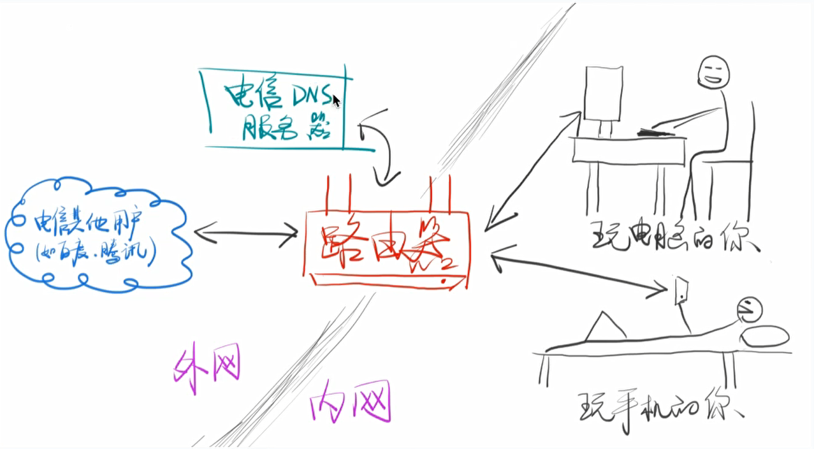

# Node.js Server

## 网络与常用 IP

HTTP 协议的主要内容是规定了响应和请求的格式怎么写，没有规定如何在网络上传输数据。数据如何在网络上传输其实是由 TCP 协议规定的，设备如何联网是由 IP 协议规定的。HTTP 协议的底层其实是由 TCP 协议和 IP 协议（简称 TCP/IP）构建的。对于 TCP 和 IP 协议，前端不需要了解很多，只需要知道《图解 HTTP》上介绍的就够用了。 IP 协议规定设备如何联网，TCP 协议规定如何在网络上传输数据，HTTP 协议规定了数据（请求和响应）如何书写，环环相扣。

### TCP 协议

TCP 协议全称传输控制协议（Transmission Control Protocol）

面试的时候可能会问以下两个相关问题，看一下两篇博客了解即可。

1. [TCP 和 UDP 的区别是什么](https://www.nowcoder.com/questionTerminal/63c8b45c91a544bd8febc1f1ff02e3b5?toCommentId=73766)
    简答：TCP 可靠、面向连接、相对 UDP 较慢；UDP 不可靠，不面向连接、相对 TCP 较快。搞定。
   - 可靠：用户向服务器发一个请求，成功与否用户是知道的。比如向百度服务器发送一个请求，如果成功就可以看到百度首页，如果失败就会看到一个错误页面。
   - 面向连接：TCP 必须发起一个连接，连接的一端是客户端，一端是服务器。
2. [TCP 的三次握手指的是什么](https://github.com/jawil/blog/issues/14)
    简答：每次建立连接前，客户端和服务端之间都要先进行三次对话才开始正式传输内容，三次对话大概是这样的：

```
1. 客户端：我要连接你了，可以吗
2. 服务端：嗯，我准备好了，连接我吧
3. 客户端：那我连接你咯。
4. 开始后面步骤                        //  应付前端面试中关于 TCP 的考题 :)
```

[此文](http://www.ruanyifeng.com/blog/2017/06/tcp-protocol.html)介绍了更多关于 TCP 协议的内容，，也可以买一本《TCP/IP 详解（卷一）》（共三卷，先只买一卷即可）。

### IP 协议

IP 协议全称网络协议（英语：Internet Protocol）

只要一个设备在互联网中，那么它就会有一个 IP。通俗上理解，IP 分为「内网 IP」 和「外网 IP」，以下图为例：

       

- 你从电信那里买来带宽
- 电信为你提供 DNS 服务。
- 你买了一个路由器，然后用电脑和手机分别连接路由器广播出来的无线 WIFI。
- 只要路由器连上电信的服务器，那么路由器就会有一个「外网 IP」，比如「14.17.32.211」就是一个外网 IP。这就是路由器在互联网中的地址。
- 但是如果重启路由器，那么路由器很有「可能」被重新分配一个「外网 IP」，也就是说 **你的路由器没有「固定的外网 IP」**
- 可以花每年几千块钱租用一个「固定的外网 IP」，但是一般人显然不会这么浪费钱。像腾讯、阿里这样的大公司租用了很多外网 IP，这样才能对我们提供稳定的服务。
- 但是有个问题，如果你的路由器的外网 IP 是14.17.32.211，那么你的手机和电脑的 IP 又是什么呢？答案是「内网 IP」
- 路由器会在你家里创建一个内网，内网中的设备使用内网 IP，一般来说这个 IP 的格式都是 192.168.xxx.xxx。
  - 一般路由会给自己分配一个好记的内网 IP，如 192.168.1.1
  - 然后路由会给每一个内网中的设备分配一个不同的内网 IP，如电脑是 192.168.1.2，手机是 192.168.1.3，以此类推。
  - 现在路由器有两个 IP，一个外网 IP（比如：14.17.32.211）和一个内网 IP（192.168.1.1）
    - 内网中的设备可以互相访问（比如你可以用电脑或手机进入 [http://192.168.1.1](http://192.168.1.1/) 来查看你的路由器），但是不能**直接**访问外网，内网设备想要访问外网，就必须经过路由器中转。
    - 外网中的设备可以互相访问（比如 qq.com 可以把首页发送给你的路由器，你的路由器有外网 IP），但是外网中的设备无法访问你的内网设备（这很好理解，内网是一个封闭的网络，外人进不来，所以实际上 qq.com 无法直接把首页放送给你的电脑和手机）
      - 问题来了，那 qq.com 是怎么把首页发送到你的手机上的呢？答案是通过路由器来中转。
      - 路由器接收到 qq.com 的页面后，把页面发送给你的电脑或手机。路由器知道如何给这些信息**指路**，路由器就是一个指路人，这就是「路由」两个字的来历。
      - 路，就是「必由之路」中的路。由，就是「必由之路」中的由（由是经过、缘由的意思）。所有的信息都要经过路由器，然后被指向一条它该去的路。
  - 也就是说内网和外网就像两个隔绝的空间，无法互通，唯一的联通点就是路由器（因为路由器既有外网 IP 也有内网 IP），所以路由器有时候也被叫做「网关」，这个「关」是「一夫当关，万夫莫开」的「关」。如果路由器到电信的连接中断了，那么内网中所有的设备也就无法上网了。（这很好理解，相当于唯一一条出去的路断了）
- 除了内网 IP 和外网 IP，还有两个特别特殊的 IP，就是本地 IP：127.0.0.1。本地 IP 永远表示设备自己。可以 `ping 127.0.0.1` 一下，会发现只需要 0.01 ms 就得到了响应（`ping qq.com` 需要几十毫秒才得到响应）
  - 默认情况下，hosts 文件里会有一行127.0.0.1 localhost，意思就是 localhost 指向 127.0.0.1，所以 localhost 也表示设备自己。`ping localhost` 试试，会发现实际上是在 `ping 127.0.0.1`。
- 还有一个特别特殊的 IP：0.0.0.0，它不表示任何设备。这个 IP 不同的地方含义不同，以后我们会用到，用到的时候再说意思

## 端口

要想访问一个设备（前提是使用的是 TCP 或 UDP 协议。还记得吗，HTTP 就使用了 TCP），只指定 IP 是不够的，还**必须**指定端口（Port）。

端口其实就是一个编号，并不是一种硬件。

一个服务器（硬件）不一定只提供一种服务，比如一个服务器既提供 HTTP 服务，又提供 FTP 服务，还提供 SMTP 服务（邮件服务），那么只用一个 IP 是无法告诉服务器你想要使用哪种服务。

所以这里有一个重【要的原则：一个端口对应一个服务。

比如：

1. 要提供 HTTP 服务最好使用 80 端口（能不能使用别的端口？可以，不过不建议违反约定）

2. 要提供 HTTPS 服务最好使用 443 端口（能不能使用别的端口？可以，不过不建议违反约定）

3. 要提供 FTP 服务最好使用 21 端口（能不能使用别的端口？可以，不过不建议违反约定）

**1. 问题1：怎么知道应该使用什么端口？**

[维基百科](https://zh.wikipedia.org/wiki/TCP/UDP端口列表#0.E5.88.B01023.E5.8F.B7.E7.AB.AF.E5.8F.A3) 把 0 到 1023 号端口对应的服务都列出来了，点进去看看吧。

**2. 问题2：一共由多少端口？**

每个机器一共有 65535（2 的16次方减1）个端口（这是协议规定的）。不过这些端口的使用有一些规定

1. 0 到 1023（2的10次方减1）号端口是留给系统使用的，你只有拥有了管理员权限后，才能使用这 1024 个端口。

2. 其他端口可以给普通用户使用

3. 如果一个端口正在提供服务，也就是被占用了，那么就不能再使用这个端口。除非你先停掉正在占用这个端口的服务。以后会经常遇到这个问题。

**3. 总结**

上面都是 TCP/IP 相关的知识，如果记不住，就记住下面这句话：

使用 HTTP 协议访问另一个 IP 时，必须同时提供 IP 和端口号，缺一不可。

那么问题来了，访问 [http://qq.com](http://qq.com/) 时并没有提供端口号，为什么依然可以访问

答：因为**浏览器**帮你加了默认端口号 80。

## Node.js 服务器

说了这么多，我们现在就来搞起一个提供 HTTP 服务服务器吧。

1. 服务器已经有了，你使用的电脑就是服务器。

2. 但是还没有提供 HTTP 服务的「程序」。

用脚本就可以提供 HTTP 服务，不管是 Bash 脚本还是 Node.js 脚本都可以。由于 Bash 脚本的语法实在是反人类，而且我们今后要学习 JavaScript，所以我们先用 Node.js 脚本试试水吧。

声明：本文的重点不是 JS 语法，所以代码可以直接复制，不用自己敲代码。本文重点是了解服务器的运行过程。

还记得吗，是李爵士写出了第一个网页、第一个浏览器和第一个服务器。

- 网页我们见过
- 浏览器我们见过
- 服务器我们从来没见过

所以对于前端程序员来说，了解服务器的原理是非常非常重要的，否则知识永远少一块。

### 接收请求

我们的脚本只需要一个文件就可以搞定

1. 新建一个安全的目录

``` shell
cd ~/Desktop
mkdir node-demo
cd node-demo
touch server.js
```
2. 编辑 server.js，[内容我已经上传到 GitHub](https://raw.githubusercontent.com/FrankFang/nodejs-test/7f1a0ce15c47a6c2c938fe322f042e5d62bc7d01/server.js)。

3. 运行 node server 或者 node server.js，看到报错
4. 根据报错提示调整你的命令
5. 成功之后，这个 server 会保持运行，无法退出

- 如果你想「中断」这个 server，按 <kb>Ctrl</kbd> + <kbd>C</kbd> 即可（C 就是 Cancel 的意思）

- 中断后你才能输入其他命令

- 建议把这个 server 放在那里别动，新开一个 Bash 窗口，完成下面的教程

到目前为止服务器完成。只不过

1. 这个服务器目前只有一个功能，那就是打印出路径和查询字符串

2. 还缺少一个重要的功能，那就是发出 HTTP 响应

目前我们先只做这一个功能。

接下来你要发起一个请求到这个服务器。这听起来有点怪异，「我向自己发起请求」，目前是的，因为买不起服务器啊。

在新的 Bash 窗口运行 `curl http://localhost:你的指定的端口/xxx` 或者 `curl http://127.0.0.1:你指定的端口/xxx`。

你会马上发现 server 打印出了路径：

1. 这说明我们的 server 收到了我们用 curl 发出的请求。

2. 由于 server 迟迟没有发出响应，所以 curl 就一直等在那里，无法退出（用 <kb>Ctrl</kbd> + <kbd>C</kbd> 中断这个傻 curl）。

### 发出响应

接下来我们让我们 server 发出响应

1. 编辑 server.js

2. 在中间我标注的区域添加两行代码

```javascript
response.write('Hi')
response.end()
```

4. 中断之前的 server，重新运行 `node server 8888`。
5. curl http://127.0.0.1:8888/xxx，结果如下：
```
Hi%
```
这个 % 不是我们的内容，% 表示结尾。如果你看 % 不爽，就把 `'Hi'` 换成 `'Hi\n'`。

6. 好了，响应添加成功

7. 使用 `curl -s -v -- "http://localhost:8888/xxx"` 可以查看完整的请求和响应。

### 根据请求返回不同的响应

1. 响应 /
2. 响应 /xxx
3. 响应 404
4. 响应 /xxx.html
5. 响应 /xxx.zhang
6. 再次强调，后缀是废话。文件内容是有 HTTP 头中的 Content-Type 保证的
7. 响应 /xxx.css
8. 响应 /xxx.js

HTTP 路径不是文件路径！！！/xxx.html不一定对应 xxx.html 文件

HTTP 路径不是文件路径！！！/xxx.css 不一定对应 x【xx.css 文件

HTTP 路径不是文件路径！！！/xxx.js 不一定对应 xxx.js 文件

重要的事情说三遍。

### 上传代码供以后复习

1. 在 GitHub 创建新的空 repo，名称为 node-demo

2. 按照 GitHub 的提示上传代码

这是完整的代码

```javascript
var http = require('http')
var fs = require('fs')
var url = require('url')
var port = process.argv[2]

if(!port){
  console.log('请指定端口号好不啦？\nnode server.js 8888 这样不会吗？')
  process.exit(1)
}

var server = http.createServer(function(request, response){
  var parsedUrl = url.parse(request.url, true)
  var path = request.url 
  
  var query = ''
  if(path.indexOf('?') >= 0){ 
    query = path.substring(path.indexOf('?'))
  }
  
  var pathNoQuery = parsedUrl.pathname
  var queryObject = parsedUrl.query
  var method = request.method

 /******** 从这里开始看，上面不要看 ************/

 console.log('HTTP 路径为\n' + path)
 if(path == '/style'){
   response.setHeader('Content-Type', 'text/css; charset=utf-8')
   response.write('body{background-color: #ddd;}h1{color: red;}')
   response.end()
 }else if(path == '/script'){
   response.setHeader('Content-Type', 'text/javascript; charset=utf-8')
   response.write('alert("这是JS执行的")')
   response.end()
 }else if(path == '/index'){
   response.setHeader('Content-Type', 'text/html; charset=utf-8')
   response.write('<!DOCTYPE>\n<html>' + 
   '<head><link rel="stylesheet" href="/style">' +
   '</head><body>' +
   '<h1>你好</h1>' +
   '<script src="/script"></script>' +
   '</body></html>')
   
   response.end()
 }else{
  response.statusCode = 404
  response.end()
 }
 
 /******** 代码结束，下面不要看 ************/
})
server.listen(port)
console.log('监听 ' + port + ' 成功\n请用在空中转体720度然后用电饭煲打开 http://localhost:' + port)
```


