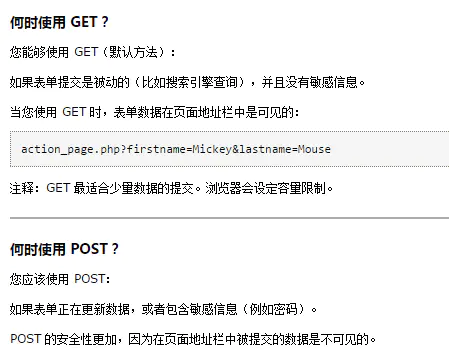
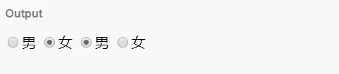

# form 表单

作用：搜集用户填写的信息，提交给网站后台（即服务器）

form 标签是表单的外壳，主要有以下 4 个属性：

1. action：信息要提交的地址

2. method：浏览器向后台传输数据的方式：get 或者 post

3. target：在何处打开 action（用的较少）

4. entype（编码方式）：

        1. application/x-www-form-urlencoded：在发送前编码所有的字符（默认） 
        2. text/plain：空格转换为"+"号，但不对特殊字符编码
        3. mutipart/form-data：使用包含文件上传控件的表单时，必须用该值

表单需要用 `<form>` 标签包围，格式如下：

```html
<form action="信息要提交的地址" method="post/get"></form>
```

## 常见 type 属性

input 标签使用 type 属性的值来规定 input 元素的类型，常见有以下类型：

| type     | 作用                                           |
| -------- | ---------------------------------------------- |
| text     | 定义单行输入框，可在其中输入文本               |
| password | 密码输入框，输入的内容在页面上以圆点展示       |
| checkbox | 定义复选框                                     |
| radio    | 定义单选框                                     |
| file     | 定义输入字段和“浏览”按钮，供文件上传           |
| hidden   | 隐藏的标签。可以用来发送默认项或者进行安全校验 |
| button   | 定义可点击的按钮，不可提交                   |
| submit   | 定义提交按钮，把表单数据发给服务器             |
| reset    | 定义重置按钮，用于清除表单中的用户输入的数据   |
| image    | 定义图像形式的提交按钮                         |
| url      | URL的绝对地址                                  |
| email    | 邮件地址                                       |
| search   | 无换行的搜索框                                 |
| tel      | 无换行的电话号码框                             |
|date|日期输入框，可以选择日期|
| time | 时间输入框 |
| number | 数字输入框，整数小数都可以 |
| range | 范围选择框，0~100 |
| color | 选择颜色 |
## post 和 get
GET和POST是HTTP请求的两种基本方法：
- POST ： 向指定的资源提交要被处理的数据
- GET ：从指定的资源请求数据

区别:[参考资料](https://juejin.im/entry/57597bd45bbb500053c88b4c)
最直观的区别就是 GET 把参数包含在 URL 中，POST 通过 request body 传递参数。

1.GET 后退按钮/刷新无害，POST 数据会被重新提交（浏览器应该告知用户数据会被重新提交）。
2.GET 书签可收藏，POST 为书签不可收藏。
3.GET 能被缓存，POST 不能缓存 。
4.GET 请求只能进行 url 编码，而 POST 支持多种编码方式。
5.GET 请求参数会被完整保留在浏览器历史记录里，而 POST 中的参数不会被保留。
6.GET 请求在 URL 中传送的参数是有长度限制的，而 POST 没有。
7.对参数的数据类型，GET 只接受 ASCII 字符，而 POST 没有限制。
8.GET 比 POST 更不安全，因为参数直接暴露在 URL 上，所以不能用来传递敏感信息。


## name 作用
name 属性规定 input 元素的名称，由于表单提交的数据一般都是以 `key:value` 的方式提交，所以 input 中的 name 属性主要用来标识提交的数据的 key 值，好让服务器处理程序分辨。
例如：

```html
<input name="username" id="username">
<input id="age">
```
上方两个input在提交表单信息上，默认情况下只有 id 为 username，具有 name 属性的 input 的数据才能提交

name 还有一个作用就是当 input 类型为 radio 或 checkbox 时，name 属性也常用于给选择框分组。比如：

```html
<input type="radio" name="a" value="张三" id="a1" />
<input type="radio" name="a" value="曾四" id="a2"/>
```
## radio 如何分组
具有相同 name 属性值的 radio 为同一组。下面代码是两组单选。

```html
<input type="radio" name="sex1">男
<input type="radio" name="sex1">女
<input type="radio" name="sex2">男
<input type="radio" name="sex2">女
```


## placeholder 作用
placeholder 属性能够让你在文本框里默认显示提示信息，一旦你在文本框里输入了什么信息，提示信息就会隐藏。

## type=hidden隐藏域
隐藏不让用户看到的信息，但这些信息对于 web 应用又是很有必要的，主要有以下作用：

1. 暂存信息：通过 hidden 隐藏域在页面中暂存一些数据信息（用户对网页操作可能会用到这些信息）

2. 信息安全：通过 hidden 隐藏域在页面中添加一些验证信息，当提交 form 表单时，服务器会收到该验证信息，然后通过一定的算法校验该验证信息，可以有效防止非法请求对数据库的增删改查，提高 web 应用的安全性

## select 
下拉菜单

格式：

```html
<select name="aa" id="bb">
  <option value="xx">xx</option>
</select>
```
> 注：在option标签中加一个selected表示默认选择
## textarea
一个可以多行输入的文本框

格式：

```html
<textarea name="comment" id="comment" cols="30" rows="10">ddd</textarea>
```
## label标签
label 标签的 for 属性可以与 input 的 id 属性配合，点击输入框前的文字时，也能进入 focus 状态