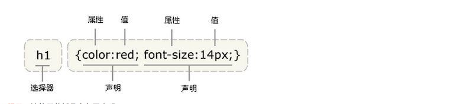

# CSS 简介
CSS 全称是层叠样式表( Cascading Style Sheets)。

## 语法

CSS 的语法只有两种规则：

1. 样式规则

```css
h1 {
  color: red;  			 /*分号不能省略*/
  font-size: 20px;		/*最后一个分号可以省略，但不建议这么做，*/
  /*这是注释*/
}
a:hover{
  color: red;
}
```

2. @ 规则

```css
@charset "utf-8";

@import url(../css/style.css);

@keyframes rainbow {
  from { background: #c00 }
  50% { background: orange }
  to { background: yellowgreen }
}

@media screen and (width>100px){
    h1 {
        color: red;
    }
}

@font-face {
    
}
```

一般格式：




## CSS引入方式

CSS 有三种引入方式，分别是内联样式，内部样式和外部样式

1. 内联样式：直接在 HTML 标签的 style 属性中设定 CSS 样式

```css
<h1 style="color: red; font-size: 20px;"></h1>
```
2. 内部样式：在 `<style>` 标签内书写 CSS 代码（`<style>` 标签一般位于 HTML 头部）

```css
<style type="text/css">
  h1 {
    color: red;
    font-size: 20px;
  }
</style>
<h1>饥人谷</h1>
```
3. 外部样式：

- 链接式：通过 HTML 头部的 `<link>` 标签从外部引入 CSS 文件

```css
<head>
  <link rel="stylesheet" type="text/css" href="index.css">
</head>
```

- 导入式：使用 CSS 规则，通过 `@import` 导入外部 CSS 文件。bootstrap 的 Less 入口文件 `bootstrap.less` 就使用了这种语法。

```css
<style>
  @import url(../css/style.css);
  @import "world.css";
</style>
```


## link 和 @import 的区别
1. 本质不同

- link 是 HTML 标签，可以放在 HTML 文件的任何位置。
- @import 是 CSS 语法，应该位于样式文件或者 `<style>` 标签里
- link 标签除了可以加载 CSS 外，还可以做很多其它的事情，比如定义 RSS，定义 rel 连接属性等，@import 就只能加载 CSS

2. 加载顺序不同

- link 标签内的样式会随着页面内容加载同步加载
- @import 引用的文件则会等页面全部下载完毕再被加载，对于有的浏览器来说，在一些情况下，如果网页文件的体积比较大，则会出现先显示无样式的页面，闪烁一下之后再出现设置样式后的效果，从浏览者的感受来说，这是导入式的一个缺陷

3. 兼容性的差别

- @import 是 CSS2.1 提出的，所以老的浏览器不支持，@import 只在 IE5 以上的才能识别，而 link 标签无此问题。但是现代前端已经不需要考虑这个问题。

4. 使用 DOM 控制样式差别

- 当使用 Javascript 控制 DOM 去改变样式的时候，只能使用 link 标签，因为 @import 不是 DOM 可以控制的

## 一般的书写规范

### HTML

- id class 建议单词全字母小写，单词间以 `-` 分隔。同项目必须保持风格一致
- HTML 标签的使用应该遵循标签的语义
- 禁止 img 的 src 取值为空。延迟加载的图片也要增加默认的 src
- 使用 button 元素时必须指明 type 属性值
- 在 CSS 可以实现相同需求的情况下不得使用表格进行布局

### CSS

- 语法不区分大小写，但建议统一使用小写
- 不使用内联的 style 属性定义样式
- 属性值是 0 的省略单位
- 小于 1 的小数省去小数点前面的 0，比如 .5
- 块内容缩进
- 属性名冒号后面添加一个空格

[编码规范 1](https://github.com/fex-team/styleguide/blob/master/css.md)

[编码规范 2](https://codeguide.bootcss.com/#html-syntax)

## 学习技巧

学习 CSS 之前，一定要有以下几个观念：

1. CSS 没有为什么，文档规定什么就是什么，没有逻辑可言。个人想法和浏览器效果有冲突的时候，只能接受事实
2. CSS 很多属性互相影响，组合起来非常复杂
3. CSS 很多属性很独立，跟其他属性一点关系都没有

4. 【观察法】—— 一定要记住**眼见为实**。

CSS 属性众多，知识点多，而一个页面往往涉及很多知识，所以需要从小到大开始，慢慢积累。比如可以自己模仿一个 UI 框架。

调试 CSS 要注意使用【border】大法，即给所有元素加上 border。因为调试一个元素的最重要的前提就是知道它在哪里以及宽高，这是 CSS 的精髓之一。

### CRM学习法

1. copy（抄文档、抄别人代码）
2. run（放到自己机器运行）
3. modify（按照自己的想法修改代码，然后重新运行）

### 宽高

宽高尽量不要写死，要从内往外写，父元素的宽高尽量使用子元素撑开。