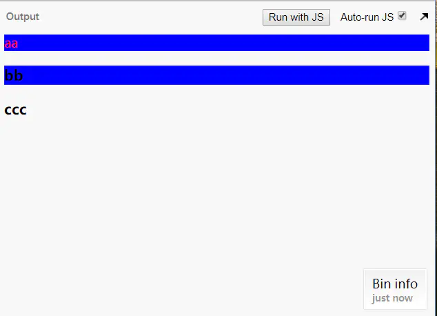

# 选择器

## class 和 id 使用场景
- id：定位到页面上唯一的元素，页面上不能出现 id 相同的元素
- class：定位到页面上某一类的元素

## 常见选择器
### 基础选择器

| 选择器  | 含义                |
| ------- | ---------------------------- |
| *       | 通用元素选择器，匹配页面任何元素（这也就决定了很少被使用） |
| #id     | id 选择器，匹配特定 id 的元素                |
| .class  | 类选择器，匹配 class 包含（不是等于）特定类的元素            |
| element | 标签选择器                               |
> 不要随便使用标签选择器

### 组合选择器

> 注意，以下 E，F 都代表上面的基础选择器，是一个条件而非必须是一个 html 标签。

组合选择器一共 6 种，最下面两种属于同一类型。

| 选择器                     | 含义                          |
| -------------- | ---------------------------------------- |
| E,F   | 多元素选择器，用,分隔，同时匹配元素E或元素F        |
| E F|后代选择器，用空格分隔，匹配E元素所有的后代（不只是子元素、子元素向下递归元素F|
| E>F | 子元素选择器，用>分隔，匹配E元素的所有直接子元素         |
| E+F   | 直接相邻选择器，匹配 E 元素之后的相邻的同级元素 F       |
| E~F  | 普通相邻选择器（弟弟选择器），匹配 E 元素之后的同级元素 F（无论直接相邻与否） |
| .class1.class2（或#id#id） | 两个 class 选择器之间没有分隔符，. 和 # 本身充当分隔符的元素。表示即又，即同时具有这两个特性的元素 |
| element#id | id 和 class 选择器和选择器连写的时候中间没有分隔符，`.` 和 `#` 本身充当分隔符的元素。意义同上 |

### 属性选择器

> 属性选择器可以认为是一个单独的规则，可以认为是基本选择器，可以和基本选择器按照组合选择器的规则进行组合

| 选择器           | 含义              |
| ----- | --------------- |
| [attr] | 匹配所有具有属性 attr 的元素 ，div[id] 就能取到所有有 id 属性的 div |
| [attr = value]  | 匹配属性 attr 值为 value 的元素，div[id=test],匹配 id=test 的 div |
| [attr ~= value] | 匹配属性 attr 的值包含单词 "value" 的所有元素 |
| [attr ^= value] | 匹配属性 attr 的值以 value 开头的元素 |
| [attr $= value] | 匹配属性 attr 的值以 value 结尾的元素 |
| [attr \*= value] |匹配属性 attr 的值包含 value 的元素      |

### 伪类选择器 

> 伪类选择器单独使用没有意义。伪类选择器大致可以分为超链接伪类，表单伪类，结构伪类几种

| 选择器        | 含义                        |
| ------------- | ------------- |
| E:link        | 匹配未被点击的链接元素 E      |
| E:visited     | 匹配已被点击的链接 E           |
| E:active      | 匹配鼠标已经其上按下、还没有释放的 E 元素  |
| E:hover       | 匹配鼠标悬停其上的 E 元素      |
| E:focus       | 匹配获得当前焦点的 E 元素          |
| E:lang(c)     | 匹配 lang 属性等于 c 的 E 元素     |
| E:enabled     | 匹配表单中可用的元素 E       |
| E:disabled    | 匹配表单中禁用的元素 E         |
| E:checked     | 匹配表单中被选中的 radio 或 checkbox 元素 E |
| E::selection  | 匹配用户当前选中的元素           |
| E:root  | 匹配文档的根元素，对于 HTML 文档，就是 HTML 元素      |
| E:first-child | 匹配作为长子（第一个子女）的元素 E，匹配到的元素既要符合 E 的条件又要是其父元素的第一个儿子。下面几个同理 |
| E:last-child | 匹配父元素的最后一个子元素 E，等同于 `E:nth-last-child(1)` |
| E:nth-child(n)   | 匹配其父元素的第 n 个子元素，第一个编号为 1。n可以设置为具体的数值或者 2n+1, 2n, 4n-1 或者 odd even |
| E:nth-last-child(n)  | 匹配其父元素的倒数第 n 个子元素，第一个编号为 1      |
| E:first-of-type  | 匹配父元素下使用同种标签的第一个子元素，等同于 `:nth-of-type(1)` |
| E:last-of-type   | 匹配父元素下使用同种标签的最后一个子元素，等同于 `:nth-last-of-type(1)` |
| E:nth-of-type(n)    | 与 `:nth-child()` 作用类似，但是仅匹配使用同种标签的元素 |
| E:nth-last-of-type(n) | 与 `:nth-last-child()` 作用类似，但是仅匹配使用同种标签的元素 |
| E:only-child    | 匹配父元素下仅有的一个子元素，等同于 `:first-child:last-child` 或 `:nth-child(1):nth-last-child(1)` |
| E:only-of-type     | 匹配父元素下使用同种标签的唯一一个子元素，等同于 `:first-of-type:last-of-type` 或 `:nth-of-type(1):nth-last-of-type(1)` |
| E:empty    | 匹配一个不包含任何子元素的元素 E，文本节点也被看作子元素 |
| E:not(selector)     | 匹配不符合当前选择器的任何元素 E |

#### n的取值

- 1，2，3，4，5
- 2n+1, 2n, 4n-1
- odd, even

### 伪元素选择器

| 选择器          | 含义                        |
| --------------- | --------------------------- |
| E::first-line   | 匹配 E 元素内容的第一行     |
| E::first-letter | 匹配 E 元素内容的第一个字母 |
| E::before       | 在 E 元素之前插入生成的内容 |
| E::after        | 在 E 元素之后插入生成的内容 |

## 选择器优先级

如果多条规则作用于同一个元素上，且定义的相同属性的不同值，比如

```css
  <style>
    #test {color: #666;}
    p {color: #333;}
  </style>

  <p id="text">Text</p>
```

这种场景下，`p` 元素文本颜色应该是哪个呢？这就要考虑选择器的优先级问题了。CSS 优先级从高到低分别是:

1. 在属性后面使用 !important 会覆盖页面内任何位置定义的元素样式
2. 作为 style 属性写在元素标签上的内联样式
3. id 选择器
4. 类选择器
5. 伪类选择器   
6. 属性选择器
7. 标签选择器
8. 通配符选择器
9. 浏览器自定义
## 复杂场景如何计算优先级

1. 首先做出以下定义
  - 行内样式 `<div style="xxx"></div>` ==> a
  - ID 选择器 ==> b
  - 类，属性选择器和伪类选择器 ==> c
  - 标签选择器、伪元素 ==> d
2. 根据以上定义分析选择器，得出 a,b,c,d 的值
3. 比较各选择器 a,b,c,d 的值，先比较 a 的值，a 的值大的优先级高，a 的值相等的情况下比较 b 的值，以此类推，得到各选择器的优先级。

### 样式覆盖

```css
  div {color: #333;}
  ....
  div {color: #666;}
```

这样 `div` 文案的颜色明显会是 `#666`。即同选择器或优先级完全一致的选择器，后面的样式会覆盖前面的。

## a:link, a:hover, a:active, a:visited 的顺序
- 顺序
  
    > a:link  a:visited  a:hover  a:active
- 原因
    1. 当链接被访问后，`a:visited` 选择器内的样式会永久生效，若 `a:visited` 选择器位于 `a:hover` 和 `a:active` 选择器后面的话，他们的样式将会被永久覆盖，不会生效。
    2. `a:active` 选择器必须位于 `a:hover` 选择器后面，否则其样式会被 `a:hover` 选择器的样式覆盖
## 选择器示例

```
#header{            
}                       匹配id名为header的元素                

.header{
}                       匹配class名为header的元素

.header .logo{      
}                       匹配class名为header的元素后代中所有class名为logo的元素

.header.mobile{
}                       匹配class既有header的又有mobile的元素

.header p, .header h3{
}                       匹配class名为header的元素后代中标签为p的元素和h3的元素

#header .nav>li{         
}                       匹配id名为header的后代中class名为nav的元素下的直接子元素

#header a:hover{ 
}                       匹配id名为header的后代中a链接鼠标指针放到链接上的样式

#header .logo~p{
}                       匹配id名为header的后代中class名为logo的同级元素中标签为p的元素

#header input[type="text"]{
}                       匹配id名为header的后代中标签为input且type属性为text的元素
```
## 几个易混选择器

`div:first-child`、`div:first-of-type`、`div :first-child` 和 `div :first-of-type` 的作用和区别 （注意空格的作用）

- div:first-child：匹配当前 div 所在层级的第一个元素【该元素必须是 div，若 div 不是第一个元素，则无效果】
- div:first-of-type：匹配 div 所在层级中所有 div 元素中的第一个
- div :first-child：匹配标签为 div 元素下的第一个子元素，相当于组合选择器和伪类选择器的组合，即是 div 元素的所有后代元素（不只是子元素、子元素向下递归中是其父元素第一个子元素）
- div :first-of-type：匹配标签为 div 元素下的相同标签的第一个元素，分析同上
> 其实伪类选择器也可以看作是组合选择器，把 `:first-child` 理解为同级的第一个元素，比如 `div:first-child` 就可以理解为即符合条件 1，既是 `div` 元素，又符合条件 2，即是其父元素的第一个孩子。比如 `div>:first-child` 可以理解为匹配 `div` 元素中的所有直接子元素中，符合是其父元素的第一个孩子条件的
> [demo](http://js.jirengu.com/jumaxoxaju/1/edit)
## 一个代码及效果实例
代码：

```
<style>
.item1:first-child{
  color: red;
}
.item1:first-of-type{
  background: blue;
}
</style>
 <div class="ct">
   <p class="item1">aa</p>
   <h3 class="item1">bb</h3>
   <h3 class="item1">ccc</h3>
 </div>
```
结果


原因
- `.item1:first-child` 匹配 class 名为 item1的父级元素的第一个子元素，即 `< p class="item1">aa< /p>`，所有 `aa` 变为字体变为红色
- `.item1:first-of-type` 匹配 `class` 名为 `item1` 的父级元素的标签不同的元素，即 `< p class="item1">aa< /p>`,`< h3 class="item1">bb< /h3>`，所以它们的背景颜色变为蓝色

## 参考

1. [mdn](https://developer.mozilla.org/zh-CN/docs/Web/CSS/Reference#%E9%80%89%E6%8B%A9%E5%99%A8)
2. [选择器](http://houdunren.gitee.io/note/css/2%20%E9%80%89%E6%8B%A9%E5%99%A8.html#%E9%80%89%E6%8B%A9%E5%99%A8)

