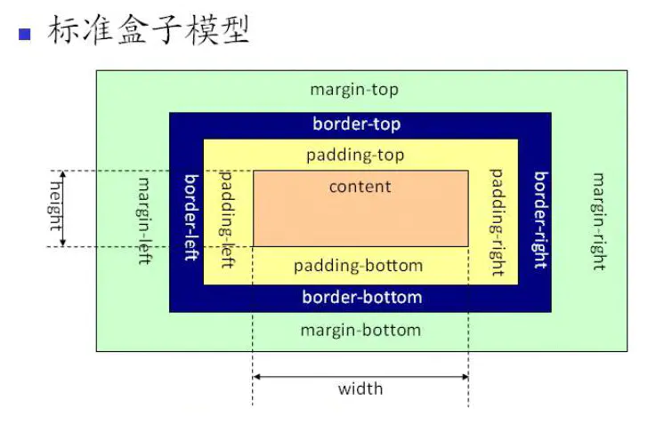
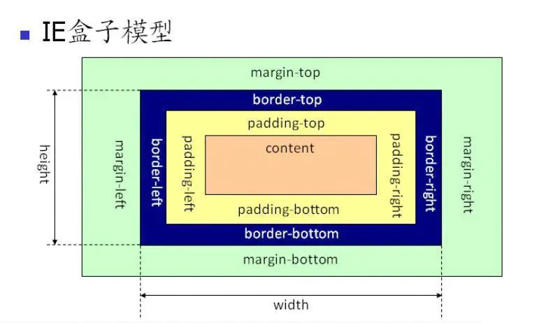

# CSS 常见样式 2

## background

| 属性                  | 描述                                       |
| :-------------------- | :----------------------------------------- |
| background            | 简写属性，作用是将背景属性设置在一个声明中 |
| background-attachment | 背景图像是否固定或者随着页面的其余部分滚动 |
| background-color      | 设置元素的背景颜色                         |
| background-image      | 把图像设置为背景                           |
| background-position   | 设置背景图像的起始位置                     |
| background-repeat     | 设置背景图像是否及如何重复                 |
| background-size       | 设置背景的大小(兼容性)                     |

- background-position：默认左上角
  - x y
  - x% y%
  - [top | center | bottom] [left | center | right]

- background-repeat
  - no-repeat：背景图片在规定位置
  - repeat-x：图片横向重复
  - repeat-y：图片纵向重复
  - repeat：全部重复

- background-size
  - `100px 100px`
  - `contain`
  - `cover`

## CSS Sprite

指将不同的图片/图标合并在一张图上。通过调整 background-position，在窗口露出不同的图标。使用 CSS Sprite 可以减少网络请求，提高网页加载性能。比如说一个网站上面有很多图标，当使用背景图片展示这些图标，即 icon 的时候，每个小图标都是一个图片，都对应着一个网络请求，即使是很小的图片。而网络请求本身是有时间开销的，所以应该减少不必要的网络请求，可以把很多的小图片合成一张大图片，在使用的时候做适当的偏移，让窗口中露出合适的图标。

## inline-block

- 既呈现 inline 特性（不占据一整行，宽度由内容宽度决定）
- 又呈现 block 特性（可设置宽高，内外边距）
- 缝隙问题。两个标签之间有空格或者回车或者 tab 时，会显示空格，但是无论有多少个以上空白字符，都只显示一个空格。想要多个空格，要加 HTML 实体 `&nbsp`。

缝隙问题的解决方法，两种：

1. 直接把标签写在一起

```html
<span></span><span></span>
```
2. 把父元素的 font-size 设置为 0，把要解决缝隙的元素的 font-size 设置正常

```html
<style>
  div{
    font-size: 0;
  }
  
  span{
    font-size: 16px; 
  }
</style>
<div>
  <span></span> 
  <span></span>
</div>

```

还需要注意的是，inline-block 和 inline 元素在垂直方向上默认以文字的基线对齐。可以设置 `vertical-align` 来确定使用何种方式对齐。

你在使用 inline-block 元素的时候一定会遇到两个bug

> 1 两个inline-block 元素之间如果有空格、回车、tab，那么在页面上就有一个空隙

标准答案：将父元素的 font-size 设置为 0，然后在 inline-block 元素中将 font-size 设置为 14px。其实有 3 种解决办法，可以去布局那一篇文章看。

实际工作：使用 block 或 float 或 flex，不要使用 inline-block

> 2 两个不同高度的 inline-block 元素无法对齐，或者下面无缘无故多出几像素

还有一种现象就是 inline-block 元素下面无缘无故多出几像素。

标准答案：改变 inline-block 元素的 vertical-align，一般改为 top 或 middle

实际工作：使用 float（用了浮动就要清除浮动） 或 flex，不要使用 inline-block

如果想搞清楚到底为什么会有这两个 bug，就看这篇文章：

[https://zhuanlan.zhihu.com/p/25808995135](https://zhuanlan.zhihu.com/p/25808995)

看完之后，保证你更加搞不清楚。

因为这是字体设计相关的知识，不是 CSS 知识。

## line-height

- line-height: 2    当前元素字体的 2 倍 
- line-height: 100% 父元素字体的 100% 这里会有一个 bug，当使用百分比时会立刻算出 line-height 的值，如果子元素字体过大则会出现 bug
- height = line-heihgt 来垂直居中单行文本

## 两种盒模型

盒模型用来描述元素所占据的空间。有两种盒模型：W3C 盒模型（标准盒模型）和 IE 盒模型。这两种盒模型，主要区别是在解释元素的 width 和 height 属性上。

### 标准盒模型

元素的 with 和 height 属性仅仅指 content area。具体如下图所示：



### IE 盒模型

元素的 with 和 height 属性由 content area + padding + border 组成。如下图所示：	



### css3新样式box-sizing

1. `box-sizing: content-box`：w3c标准盒模型
2. `box-sizing: border-box`：“IE盒模型”

## text-align

作用：设置内联元素的水平居中位置

写在块级元素上，但并不控制块元素自己的对齐。只控制它内部的行级元素对齐方式

## 让一个元素"看不见"的几种方式

1. `opacity: 0` 元素的透明度为 0，让元素不可见，但元素仍然占据原本的页面空间
2. `visibility: hidden` 和 `opacity: 0` 类似，将元素隐藏，但元素仍然占据原本的页面空间
3. `display:none` 让元素消失，不占用页面位置
4. background-color：rgba（0，0，0，0.2）；设置背景色透明

## icon 的实现方式

[icon](./12-2-icon的各种实现方式.md)

参考：

[inline-block 的 bug](https://zhuanlan.zhihu.com/p/25808995135](https://zhuanlan.zhihu.com/p/25808995))