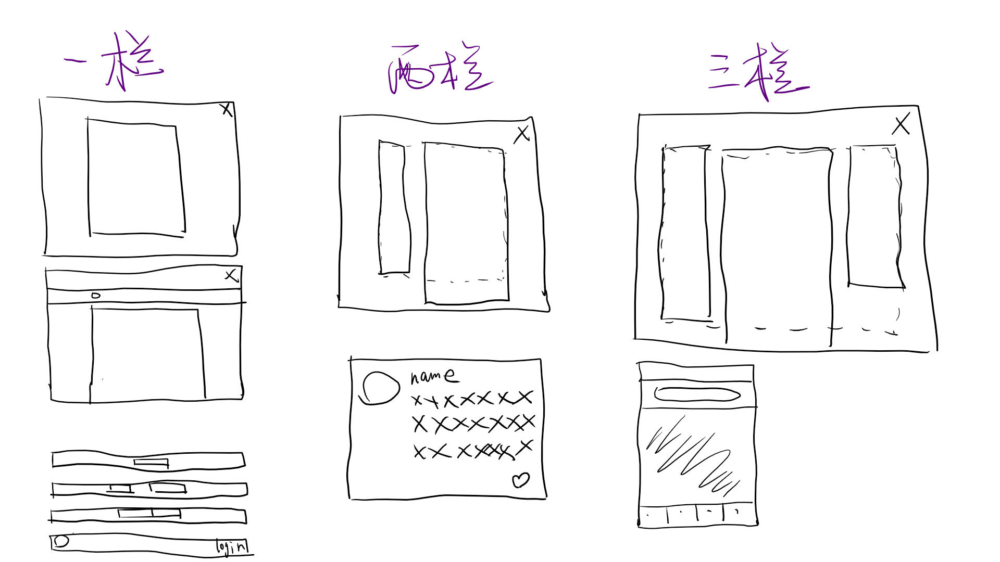

# 布局

## 什么是布局

布局就是把一个页面像切豆腐一样分开。

现有样式不能满足人们的需求

- 文档流（普通流）
- 浮动
- 定位

人们需要：

- 导航栏+内容
- 导航栏+内容+广告栏
- 从上到下、从左到右、定宽、自适应...

CSS 2 并没有提供原生支持，所以需要将一些属性组合起来，以实现布局。CSS 3 有一个 flex 属性，直接支持布局。

## DIV + CSS 布局

中国特色，国外一般不这么叫。`div` 是一个无语义的标签，适合用来做与内容无关的事情。只能用 `div` 吗？

1. 不一定
2. 尽量使用有语义的标签

## 常见布局（PC）

### 分类

- 固定宽度布局。
  - 大部分网站都是固定布局。
  - 优点：实现起来简单，页面样式不会因为窗口宽度变化而乱。
  - 缺点：如果窗口宽度小于窗口宽度时，会出现滚动条。
- 弹性（fluid）布局
  - 页面样式不定，随着窗口的宽度变化而变化。
  - 优点：不会出现滚动条。设计的合理的话会比固定宽度好看。
  - 缺点：设计和实现起来都非常复杂，因为设备屏幕是千变万化的。样式设计不到位的话很容易乱。
- 响应式布局 —— 多终端（PC、Pad、Phone）
  - 利用媒体查询进行一些响应式的适配。在某个宽度下使用合适的样式

### 示例图



## 响应式

不到最后关头，不要写死元素的宽高，要用实际内容，padding 等把父元素撑起来。

## FLEX 布局

[FLEX 布局](../self-blogs/css/flex布局.md)

## 几个易忘的细节用法

- `max-width`  和 `min-width` 的用法
- 边框 `border` 是可以单独设置的，比如 `border-right: 0`。圆角也是可以单独设置的，方向也是上右下左，比如：`border-radius: 1px 0 2px 0`

- 消除两个内联元素之间的空隙

```html
<!-- 方法 1 -->
<!-- 直接把两个内联元素写到一行。这种方法不能在实际开发中使用 -->
<div>
  <span></span><span></span>
</div>

<!-- 方法 2 -->
<!-- 父元素 font-size 设置为 0，子元素 font-size 设置为正常值。这种方法看起来很完美，但是父元素的 font-size 设置为 0 可能会对单位为 em 的属性产生影响，故也不要使用 -->

<div>
  <span></span>
  <span></span>
</div>
<style>
  div {
    font-size: 0;
  }
  span {
    font-size: 14px;
  }
</style>

<!-- 方法 3 -->
<!-- 用一个 inline-block 元素包裹住两个内敛元素并设置内联元素浮动。再设置用来包含的 inline-block 元素居中。注意 inline-block 元素尽量不要使用，只有在这种情况下可以使用 -->
<div class="parent">
  <div class="child clearfix">
    <span></span>
    <span></span>
  </div>
</div>

<style>
  .clearfix::after {
    content: '';display: block;clear: both;
  }
  span {
    float: left;
  }
  .child {
    display: inline-block;
  }
    
  .parent {
    text-align: center;
  }
</style>
```

在做布局时候尽量不使用 inline-block，因为会出现空隙等 bug，空隙不是什么时候都需要的。还有如果元素高度不一样，会出现垂直方向上的对齐问题。只有一种情况下可以使用 inline-block，那就是上面的第三种情况，即 inline-block 没有兄弟元素时候使用，上面两种不期待的问题都不会出现。

## 再次回顾 CSS 学习技巧

### 方法

即 CRM

1. Copy from MDN / CSS Tricks
   - CSS Tricks 是一个讲 CSS 小技巧的网站。直接使用谷歌搜索想要做的效果即可。比如 `css border triangle`。
2. Run in JSBin
3. Modify in Chrome Developer Tool

### 学习心态

- CSS 属性太多，没办法一次就记全，只能一个一个记。不要放过任何一个记住的机会。
- 遇到一个陌生的 CSS 属性，就应该通过 CRM 的方法学会然后记住。
- 如果真的要看所有属性，可以搜索 MDN CSS。
