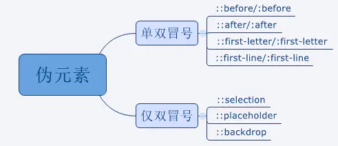

# 伪类和伪元素

## 伪类


> 伪类用于当已有元素处于的某个状态时，为其添加对应的样式，这个状态是根据用户行为而动态变化

注意：是页面上已有的元素。从字面意思上理解，伪类就是不是真正或者说常规的的 class，而是在一定条件下元素才具有这个 class。

### first-child vs first-of-type

- `h1:first-child`: 选择是h1并且它是长子的元素
- `h1:first-of-type`: 选择是h1并且它是它父亲里h1类型中的长子的元素

```html
<div class="wrap">
  <h1>我是大标题1</h1>
  <p>我是段落2</p>
  <h1>我是大标题3</h1>
</div>
<style>
.wrap h1:first-of-type{
  background: yellow;
}
.wrap p:first-of-type{
  background: pink;
}
.wrap h1:first-child{
  color: red;
}
.wrap p:first-child{
  color: blue;
}  
</style>
```

[first-child 和 first-of-type](http://js.jirengu.com/baqo/1/edit?html,css,output)

## 伪元素



> 伪元素用于创建一些不在文档树中的元素，并为其添加样式。

依然从字面意义上理解，伪元素就是给页面添加一个元素或者说是标签，但是它又不等同于真正的 HTML 元素。

### :before :after

- element:before 在element内部创建一个行内元素，作为element的第一个孩子
- element:after 在element内部创建一个行内元素，作为element的最后一个个孩子
- 用:before :after 的目的是为了省标签
- 其中content 是必不可少

### 应用

#### 清除浮动

```
.clearfix:after {
    content:"";
    display:block;
    clear:both;
}
```

[清除浮动](http://js.jirengu.com/kiwo/1/edit?html,css,output)

#### 替代标签

 

hi, 这里是饥人谷


```html
<div class="tooltip">
	<span class="caret"></span>
	hi, 这里是美丽的杭州
</div>
<div class="bubble">hi, 这里是美丽的杭州</div>

<style>
  .tooltip, 
  .bubble{
  position: relative;
  padding: 10px;
  border-radius: 3px;
  background: #fff;
  border: 1px solid #000;
  display: inline-block;
}
```

[替代标签](http://js.jirengu.com/buqo/1/edit?html,output)

#### 字体图标

这个在 icon 的实现方式那一篇文章有介绍，这里就不重复介绍了。

参考文章 1 写的非常好，值得反复阅读。

## 参考

- [Alloy Team - 总结伪类与伪元素](http://www.alloyteam.com/2016/05/summary-of-pseudo-classes-and-pseudo-elements/)
- [W3C - Pseudo-elements and pseudo-classes](https://www.w3.org/TR/CSS2/selector.html#pseudo-elements)
- [W3C - Pseudo-elements and pseudo-classes 翻译版](http://www.ayqy.net/doc/css2-1/selector.html#pseudo-elements)