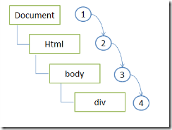
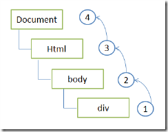
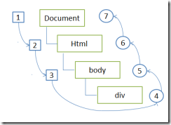

# 事件

## 事件流

事件流描述的是从页面中接收事件的顺序，比如有两个嵌套的 div，点击了内层的 div，这时候是内层的 div 先触发 click 事件还是外层先触发？目前主要有三种模型

1. 事件冒泡：事件开始时由最具体的元素接收，然后逐级向上传播到较为不具体的元素
2. 事件捕获：不太具体的节点更早接收事件，而最具体的元素最后接收事件，和事件冒泡相反
3. DOM 事件流：DOM2 级事件规定事件流包括三个阶段，事件捕获阶段，处于目标阶段，事件冒泡阶段。首先发生的是事件捕获，为截取事件提供机会，然后是实际目标接收事件，最后是冒泡阶段

这种分歧在日常生活中也很常见，举个例子，某个地方出了抢劫事件，我们有多种处理方式

1. 村里先发现，报告给乡里，乡里报告到县城，县城报告给市里。。。。
2. 市里先知道这事儿，然后交代给县城怎么处理，县城交给到乡里处理，乡里交给村里处理

Opera、Firefox、Chrome、Safari 都支持 DOM 事件流，IE 不支持事件流，只支持事件冒。

  

## addEventListener 和 onxxx 的区别

`onxxx` 是给一个元素添加属性，属性值是一个方法，当再次添加时后面会覆盖前面的

`addEventListener` 是一个方法，方法执行几次都可以，所以可以添加很多事件监听器

接受三个参数：

1. 事件类型
2. 事件处理方法
3. 布尔参数，如果是 true 表示在捕获阶段调用事件处理程序，如果是 false，则是在事件冒泡阶段处理。默认是 false。

> 注意：this 都是绑定事件的元素。

比如：

```html
<input id="btnClick" type="button" value="Click Here" />

<script type="text/javascript">
    var btnClick = document.getElementById('btnClick');
    btnClick.onclick = function showMessage1() {
        alert(this.id);
    };
    
    // 会覆盖上面的
    btnClick.onclick = function showMessage2() {
        alert(this.id);
    };
</script>

<input id="btnClick" type="button" value="Click Here" />

<script type="text/javascript">
    var btnClick = document.getElementById('btnClick');

    btnClick.addEventListener('click', function() {
        alert(this.id);
    }, false);

    btnClick.addEventListener('click', function() {
        alert('Hello!');
    }, false);
    
    // 两个事件处理程序会在用户点击 button 后按照添加顺序依次执行。
</script>
```

移除事件只能通过 `removeEventListener()` 移除，移除时参数与添加的时候相同，这就意味着刚才我们添加的匿名函数无法移除。

## this 和事件对象

this 代表响应事件的元素。即 `addEventListener()` 函数前面的对象。不要把作用域和 this 搞混了，作用域是基于词法分析，而 this 不是词法分析，两个完全不一样。

在触发 DOM 元素上的某个事件的时候会产生一个事件对象 event，这个对象包含着所有与事件有关的信息，包括产生事件的元素、事件类型等相关信息。所有浏览器都支持 event 对象，但支持方式不同。事件对象可以作为参数传递给 `addEventListener()` 的回调函数。`e.target` 和 `this` 不一定是一样， `e.target` 代表事件最原始或者说最精确的触发点，比如说我们点击的那个元素。事件代理中经常会用到 `e.target`。具体见[事件代理](https://jsbin.com/defawes/3/edit?js,output)。

```javascript
var xxx = document.querySelector('xxx')
xxx.addEventListener('click', function(e){
  console.log(e.target)
})
```

## 阻止默认事件和事件冒泡

主要记住 `e.preventDefault()` 和 `e.stopPropagation()`。

```javascript
document.querySelector('form').addEventListener('submit', function(e){
  e.preventDefault()
  if(document.querySelector('input[name=username]').value === 'xxx'){                         this.submit() // 可以做一些表单验证
  }
})
```

## 事件捕获和事件冒泡

是两种响应事件的时机。

1. 在事件冒泡阶段事件到达元素时执行方法
2. 在事件捕获阶段时间到达元素时执行方法

默认是在冒泡阶段，但是给 `addEventListener()` 方法设置参数为 true 可以改变时机。

## 事件代理

事件代理的本质就是利用事件冒泡的特性把事件监听器绑定到父元素上。

事件代理的应用场景是页面上需要新增一些元素，而这些元素都是需要绑定事件的。

[事件代理](https://jsbin.com/defawes/3/edit?js,output)

## 常用事件

用的时候看看就行。

注意 mouseover mouseout 和 mousenter mouseleave 的区别。一般使用后面一对。

### 鼠标事件

mousedown, mouseup,click, dbclick, mousewheel, mousemove, mouseover, mouseout

### 触摸事件

touchstart, touchend, touchmove

### 键盘事件

keydown, keyup, keypress

### 页面相关事件

load, move(浏览器窗口被移动时触发), resize(浏览器的窗口大小被改变时触发), scroll(滚动条位置发生变化时触发)

### 表单相关事件

blur：元素失去焦点时触发

change：元素失去焦点且元素内容发生改变时触发

focus：元素获得焦点时触发

reset：表单中reset属性被激活时触发

submit：表单被提交时触发)

input：在input元素内容修改后立即被触发，兼容 IE9+

### 编辑事件

beforecopy：当页面当前的被选择内容将要复制到浏览者系统的剪贴板前触发此事件；

beforecut：当页面中的一部分或者全部的内容将被移离当前页面[剪贴]并移动到浏览者的系统剪贴板时触发此事件；

beforeeditfocus：当前元素将要进入编辑状态；

beforepaste：内容将要从浏览者的系统剪贴板传送[粘贴]到页面中时触发此事件；

beforeupdate：当浏览者粘贴系统剪贴板中的内容时通知目标对象；

contextmenu：当浏览者按下鼠标右键出现菜单时或者通过键盘的按键触发页面菜单时触发的事件；

copy：当页面当前的被选择内容被复制后触发此事件；

cut：当页面当前的被选择内容被剪切时触发此事件；

losecapture：当元素失去鼠标移动所形成的选择焦点时触发此事件；

paste：当内容被粘贴时触发此事件；

select：当文本内容被选择时的事件；

selectstart：当文本内容选择将开始发生时触发的事件；

### 拖动事件

drag：当某个对象被拖动时触发此事件 [活动事件]；

dragdrop：一个外部对象被鼠标拖进当前窗口时触发；

dragend：当鼠标拖动结束时触发此事件；

dragenter：当对象被鼠标拖动的对象进入其容器范围内时触发此事件；

dragleave：当对象被鼠标拖动的对象离开其容器范围内时触发此事件；

dragover：当某被拖动的对象在另一对象容器范围内拖动时触发此事件；

dragstart：当某对象将被拖动时触发此事件；

drop：在一个拖动过程中，释放鼠标键时触发此事件；

还可以自定义事件。