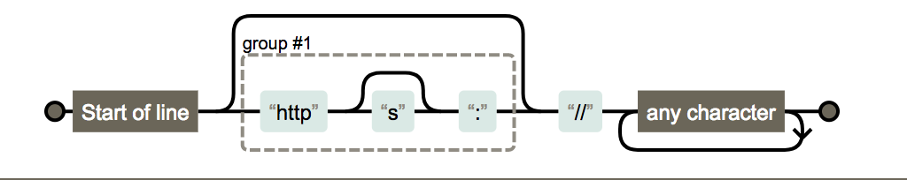
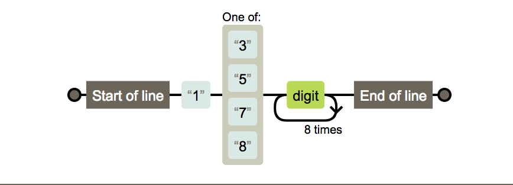
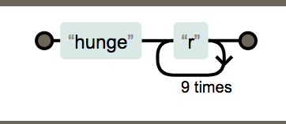
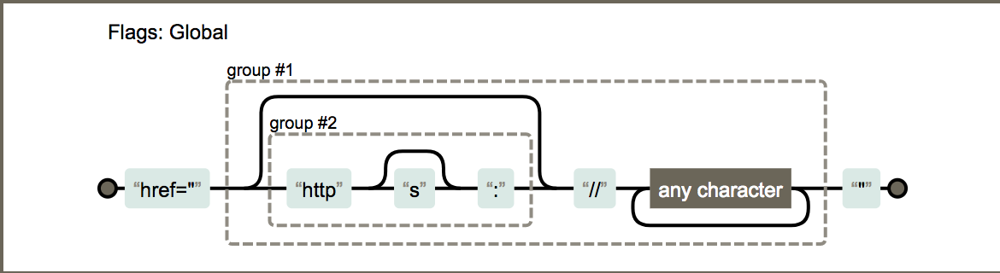
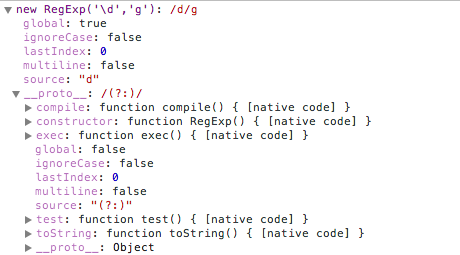

# 正则表达式

正则表达式(Regular Expression)是计算机科学的一个概念。正则表达式使用单个字符串来描述、匹配一系列符合某个句法规则的字符串。在很多文本编辑器里，正则表达式通常被用来检索、替换那些符合某个模式的文本。

## 创建

JavaScript 通过内置对象 `RegExp` 支持正则表达式，有两种方式创建正则表达式对象，如果我们想匹配字符串中 `<%xxx%>` 两个百分号分割的字符串可以这么写

1. 构造函数

   ```javascript
    var reg = new RegExp('<%[^%>]+%>','g');
   ```

2. 字面量

   ```javascript
    var reg = /<%[^%>]%>/g;
   ```

最后的 g 代表全局，还有几个修饰符

1. g：global，全文搜索，不添加的话搜索到第一个结果停止搜索
2. i：ingore case，忽略大小写，默认大小写敏感
3. m：multiple lines，多行搜索

## 元字符

正则表达式让人望而却步以一个重要原因就是转义字符太多了，组合非常多，但是正则表达式的元字符（在正则表达式中具有特殊意义的专用字符，可以用来规定其前导字符）并不多

```
( [ { \ ^ $ | ) ? * + .
```

并不是每个元字符都有特定的意义，在不同的组合中元字符有不同的意义，分类看一下

| 字符 | 含义       |
| ---- | ---------- |
| \t   | 水平制表符 |
| \r   | 回车符     |
| \n   | 换行符     |
| \f   | 换页符     |
| \v   | 垂直制表符 |
| \0   | 空字符     |

## 字符类

一般情况下正则表达式一个字符（转义字符算一个）对应字符串一个字符，表达式 `jirengu` 的含义是


但是我们可以使用元字符`[]`来构建一个简单的类, 比如 `[abcd]` 代表**一个**字符，这个字符可以是 `abcd` 四个字符中的任意一个

### 取反

元字符 `[]` 组合可以创建一个类，我们还可以使用元字符 `^` 创建**反向类/负向类**，反向类的意思是不属于 XXX 类的内容，表达式 `[^abc]` 表示**一个**不是字符 a 或 b或 c 的字符。


## 范围类

按照上面的说明如果希望匹配单个数字那么表达式是这样的

``` 
  //匹配一个字符，这个字符可以是0-9中的任意一个
    var reg1 = /[0123456789]/

    //匹配一个字符，这个字符可以是0-9中的任意一个
    var reg2 = /[0-9]/

    //匹配一个字符，这个字符可以是a-z中的任意一个
    var reg3 = /[a-z]/

    //匹配一个字符，这个字符可以是大写字母、小写字母、数字中的任意一个
    var reg3 = /[a-zA-Z0-9]/
```

## 预定义类

三对加一个 `.` 一共 7 个

| 字符 | 等价类            | 含义                             |
| ---- | ----------------- | -------------------------------- |
| .    | `[^\r\n]`         | 除了回车符和换行符之外的所有字符 |
| \d   | `[0-9]`           | 数字字符                         |
| \D   | `[^0-9]`          | 非数字字符                       |
| \s   | `[\t\n\x0B\f\r]`  | 空白符                           |
| \S   | `[^\t\n\x0B\f\r]` | 非空白符                         |
| \w   | `[a-zA-Z_0-9]`    | 单词字符，字母、数字下划线       |
| \W   | `[^a-zA-Z_0-9]`   | 非单词字符                       |

有了这些预定义类，写一些正则就很方便了，比如我们希望匹配一个可以是 `ab+数字+任意字符` 的字符串，就可以这样写了 `/ab\d./`


## 边界

正则表达式还提供了几个常用的边界匹配字符

| 字符 | 含义        |
| ---- | ----------- |
| ^    | 以 xxx 开头 |
| $    | 以 xxx 结尾 |
| \b   | 单词边界    |
| \B   | 非单词边界  |

```javascript
var str = 'hello1 world hello2 123456 \t \r world \n nihao hello3'
str.match(/hello\d/g)   // ["hello1", "hello2", "hello3"]
str.match(/^hello\d/g)  // ["hello1"]
str.match(/hello\d$/g)   // ["hello3"]

var str2 = 'hello1 whello9orld hello2 12-hello8-3456 \t \r areyouok \n ruofeifeifei hello3'
str2.match(/\bhello\d\b/g)   //["hello1", "hello2", "hello8", "hello3"] 
//注意-也用于区分单词边界
```

测试题：

变量 className 为页面 DOM 元素对应的 class 属性字符串，以下代码是检测 className 中是否包含值为 "header" 的 class，写法是否正确，如不正确给出反例，并写出正确代码

```javascript
var className = xxx
if(className.match(/\bheader\b/)){
    console.log('has class: header')
}
```

答案： 以上写法不正确，比如 `className = "header3 clearfix active header-fixed"`，此时页面元素并没有 header 这个 class，但上面的代码会认为有。是因为`-`也是单词边界

正确的写法是:

```javascript
var reg = /(^|\s)header($|\s)/g
```

## 量词

之前我们介绍的方法都是字符之间一一匹配的，如果我们希望匹配一个连续出现 20 次数字的字符串难道我们需要写成这样

```
\d\d\d\d...
```

为此正则表达式引入了一些量词

| 字符  | 含义                           |
| ----- | ------------------------------ |
| ?     | 出现零次或一次（最多出现一次） |
| +     | 出现一次或多次（至少出现一次） |
| *     | 出现零次或多次（任意次）       |
| {n}   | 出现n次                        |
| {n,m} | 出现n到m次                     |
| {n,}  | 至少出现n次                    |

```javascirpt
var str1 = 'http://baidu.com'
str1.match(/https?:\/\/.+/)  //匹配
str1.match(/https+:\/\/.+/)  //不匹配
str1.match(/https*:\/\/.+/)  //匹配

var str2 = 'https://baidu.com'
str2.match(/https?:\/\/.+/)  //匹配
str2.match(/https+:\/\/.+/g) //匹配
str2.match(/https*:\/\/.+/g) //匹配

var str3 = 'httpssssss://jirengu.com'
str3.match(/https?:\/\/.+/g)  //不匹配
str3.match(/https+:\/\/.+/g)  //匹配
str3.match(/https*:\/\/.+/g)  //匹配
```

测试题：

如何匹配一个合法的 url？提示：url 以 http 或者 https 或者 `//` 开头

```javascript
var reg = /^(https?:)?\/\/.+/
```



测试题：

如何匹配一个手机号？提示手机号以 1 开头，长度为 11 位数字

```javascript
var reg = /1[3578]\d{9}/ // 错误
var reg2 = /^1[3578]\d{9}$/ //正确
```



## 贪婪模式与非贪婪模式

看了上面介绍的量词，也许爱思考的你会想到关于匹配原则的一些问题，比如 `{3,5}` 这个量词，要是在句子中出现了十次，那么他是每次匹配三个还是五个，反正 3、4、5 都满足 3～5 的条件

量词在默认下是尽可能多的匹配的，也就是大家常说的贪婪模式

```javascript
'123456789'.match(/\d{3,5}/g); //["12345", "6789"]
```

既然有贪婪模式，那么肯定会有非贪婪模式，让正则表达式尽可能少的匹配，也就是说一旦成功匹配不再继续尝试，做法很简单，在量词后加上`?`即可

```javascript
'123456789'.match(/\d{3,5}?/g); //["123", "456", "789"]
```

## 分组

有时候我们希望使用量词的时候匹配多个字符，而不是像上面例子只是匹配一个，比如希望匹配 Byron 出现 20 次的字符串，我们如果写成 hunger{10} 的话匹配的是 hunge＋r 出现10次

```javascript
/hunger{10}/
```



怎么把hunger作为一个整体呢？使用`()`就可以达到此目的，我们称为分组

```javascript
/(hugner){10}/
```


### 或

```javascript
var reg1 = /hello|world/ 
//等同于
var reg2 = /(hello)|(world)/
```

### 分组嵌套

举例：

从 HTML 字符串中取出 URL

```javascript
var str = '<a href="http://baidu.com">"百度"</a>'
var reg = /href="((https?:)?\/\/.+?)"/
console.log(str.match(reg)) //["href="http://baidu.com"", "http://baidu.com", "http:"]

var url = str.match(reg)[1]
```



## 前瞻

| 表达式       | 含义                      |
| ------------ | ------------------------- |
| exp1(?=exp2) | 匹配后面是 exp2 的 exp1   |
| exp1(?!exp2) | 匹配后面不是 exp2 的 exp1 |

有些抽象，看个例子

```
hunger(?=Byron)


(/good(?=Byron)/).exec('goodByron123'); //['good']
(/good(?=Byron)/).exec('goodCasper123'); //null
(/bad(?=Byron)/).exec('goodCasper123');//null
```

通过上面例子可以看出 `exp1(?=exp2)` 表达式会匹配`exp1`表达式，但只有其后面内容是exp2的时候才会匹配，也就是两个条件，exp1(?!exp2) 比较类似

```
good(?!Byron)

(/good(?!Byron)/).exec('goodByron123'); //null
(/good(?!Byron)/).exec('goodCasper123'); //['good']
(/bad(?!Byron)/).exec('goodCasper123');//null
```

## 正则表达式——相关方法

RegExp 对象实例有几个属性



RegExp 实例对象有五个属性：

- global：是否全局搜索，默认是 false
- ignoreCase：是否大小写敏感，默认是 false
- multiline：多行搜索，默认值是 false
- lastIndex：是当前表达式模式首次匹配内容中最后一个字符的下一个位置，每次正则表达式成功匹配时，lastIndex 属性值都会随之改变
- source：正则表达式的文本字符串

除了将正则表达式编译为内部格式从而使执行更快的 `compile()` 方法，对象还有两个我们常用的方法

### RegExp.prototype.test(str)

方法用于测试字符串参数中是否存正则表达式模式，如果存在则返回true，否则返回false

```
var reg = /\d+\.\d{1,2}$/g;

reg.test('123.45'); //true
reg.test('0.2'); //true

reg.test('a.34'); //false
reg.test('34.5678'); //false
```

### RegExp.prototype.exec(str)

方法用于正则表达式模式在字符串中运行查找，如果`exec()`找到了匹配的文本，则返回一个结果数组,否则返回 null

除了数组元素和length属性之外，`exec()`方法返回对象还包括两个属性。

1. index 属性声明的是匹配文本的**第一个**字符的位置
2. input 属性则存放的是被检索的字符串 string

#### 非全局调用

调用**非全局**的 RegExp 对象的 `exec()` 时，返回数组的第一个元素是与正则表达式相匹配的文本，第二个元素是与 RegExpObject 的第一个子表达式相匹配的文本（如果有的话），第三个元素是与 RegExp 对象的第二个子表达式相匹配的文本（如果有的话），以此类推。

#### 全局调用

调用全局的 RegExp 对象的 `exec()` 时，它会在 RegExp 实例的 `lastIndex` 属性指定的字符处开始检索字符串string

1. 当 `exec()` 找到了与表达式相匹配的文本时，在匹配后，它将把 RegExp 实例的 `lastIndex` 属性设置为匹配文本的最后一个字符的下一个位置。可以通过反复调用 `exec()` 方法来遍历字符串中的所有匹配文本
2. 当 `exec()` 再也找不到匹配的文本时，它将返回 null，并把 lastIndex 属性重置为 `0`

 

```javascript
var reg = /\d/g;

var r = reg.exec('a1b2c3');
console.log(reg.lastIndex); //2

r=reg.exec('a1b2c3');
console.log(reg.lastIndex); //4


var reg=/\d/g;
while(r=reg.exec('a1b2c3')){
    console.log(r.index+':'+r[0]);
}
```

可以看到结果

```javascript
1:1
3:2
5:3
```

除了上面的两个方法，有些字符串函数可以传入RegExp 对象作为参数，进行一些复杂的操作

### String.prototype.search(reg)

`search()` 方法用于检索字符串中指定的子字符串，或检索与正则表达式相匹配的子字符串

`search()` 方法不执行全局匹配，它将忽略标志 `g`，它同时忽略正则表达式对象的 `lastIndex` 属性，并且总是从字符串的开始进行检索，这意味着它总是返回字符串的第一个匹配的位置

```javascript
'a1b2c3'.search(/\d/g); //1
'a1b2c3'.search(/\d/); //1
```

### String.prototype.match(reg)

`match()` 方法将检索字符串，以找到一个或多个与 regexp 匹配的文本。但 regexp 是否具有标志 `g` 对结果影响很大。

#### 非全局调用

如果 regexp 没有标志`g`，那么 `match()` 方法就只能在字符串中执行一次匹配。如果没有找到任何匹配的文本，`match()` 将返回 null。否则它将返回一个数组，其中存放了与它找到的匹配文本有关的信息。

该数组的第一个元素存放的是匹配文本，而其余的元素存放的是与正则表达式的子表达式匹配的文本。除了这些常规的数组元素之外，返回的数组还含有两个对象属性

1. index 属性声明的是匹配文本的起始字符在字符串中的位置
2. input 属性声明的是对 stringObject 的引用

看个例子

```javascript
var r = 'aaa123456'.match(/\d/);
```

#### 全局调用

如果 regexp 具有标志 `g` 则 `match()` 方法将执行全局检索，找到字符串中的所有匹配子字符串

若没有找到任何匹配的子串，则返回 null。如果找到了一个或多个匹配子串，则返回一个数组

不过全局匹配返回的数组的内容与前者大不相同，它的数组元素中存放的是字符串中所有的匹配子串，而且也没有 `index` 属性或`input`属性。

```javascript
var r = 'aaa123456'.match(/\d/g);
```

### String.prototype.replace(reg, replaceStr)

关于 string 对象的 `replace` 方法，我们最常用的是传入两个字符串的做法，但这种做法有个缺陷，只能 replace 一次

```javascript
'abcabcabc'.replace('bc','X'); //aXabcabc
```

replace 方法的第一个参数还可以传入 RegExp 对象，传入正则表达式可以使 replace 方法更加强大灵活

```javascript
'abcabcabc'.replace(/bc/g,'X'); //aXaXaX
'abcaBcabC'.replace(/bc/gi,'X'); //aXaXaX
```

如果 replace 方法的第一个参数传入的是带分组的正则表达式，我们在第二个参数中可以使用 `$1...$9` 来获取相应分组内容，比如希望把字符串 `1<%2%>34<%567%>89` 的 `<%x%>` 换为 `$#x#$`，我们可以这样

```javascript
'1<%2%>34<%567%>89'.replace(/<%(\d+)%>/g,'@#$1#@');
//"1@#2#@34@#567#@89"
```

当然还有很多方式可以达到这一目的，这里只是演示一下利用分组内容，我们在第二个参数中使用 `@#$1#@`，其中 `$1` 表示被捕获的分组内容，在一些 js 模板函数中可以经常见到这种方式替换字符串

### String.prototype.replace(reg, function)

可以通过修改 replace 方法的第二个参数，使 replace 更加强大，在前面的介绍中，只能把所有匹配替换为固定内容，但如果我希望把一个字符串中所有数字，都用小括号包起来该怎么弄

```
'2398rufdjg9w45hgiuerhg83ghvif'.replace(/\d+/g,function(r){
    return '('+r+')';
}); //"(2398)rufdjg(9)w(45)hgiuerhg(83)ghvif"
```

把 replace 方法的第二个参数传入一个 function，这个 function 会在每次匹配替换的时候调用，算是个每次替换的回调函数，我们使用了回调函数的第一个参数，也就是匹配内容，其实回调函数一共有四个参数

- 第一个参数很简单，是匹配字符串
- 第二个参数是正则表达式分组内容，没有分组则没有该参数
- 第三个参数是匹配项在字符串中的index
- 第四个参数则是原字符串

看个例子

```
'2398rufdjg9w45hgiuerhg83ghvif'.replace(/\d+/g,function(a,b,c){
    console.log(a+'\t'+b+'\t'+c);
    return '('+a+')';
});
```

结果是

```
2398    0    2398rufdjg9w45hgiuerhg83ghvif
9    10    2398rufdjg9w45hgiuerhg83ghvif
45    12    2398rufdjg9w45hgiuerhg83ghvif
83    22    2398rufdjg9w45hgiuerhg83ghvif
```

这是没有分组的情况，打印出来的分别是 匹配内容、匹配项index和原字符串，看个有分组的例子，如果我们希望把一个字符串的`<%%>`外壳去掉，`<%1%><%2%><%3%>` 变成`123`

```
'<%1%><%2%><%3%>'.replace(/<%([^%>]+)%>/g,function(a,b,c,d){
    console.log(a+'\t'+b+'\t'+c+'\t'+d);
    return b;
}) //123
```

结果是

```
<%1%>    1    0    <%1%><%2%><%3%>
<%2%>    2    5    <%1%><%2%><%3%>
<%3%>    3    10    <%1%><%2%><%3%>
```

根据这种参 数replace 可以实现很多强大的功能，尤其是在复杂的字符串替换语句中经常使用

### String.prototype.split(reg)

我们经常使用split方法把字符串分割为字符数组

```
'a,b,c,d'.split(','); //["a", "b", "c", "d"]
```

和replace方法类似，在一些复杂的分割情况下我们可以使用正则表达式解决

```
'a1b2c3d'.split(/\d/); //["a", "b", "c", "d"]
```

## 参考

[司徒正美 JavaScript正则表达式](http://www.cnblogs.com/rubylouvre/archive/2010/03/09/1681222.html)